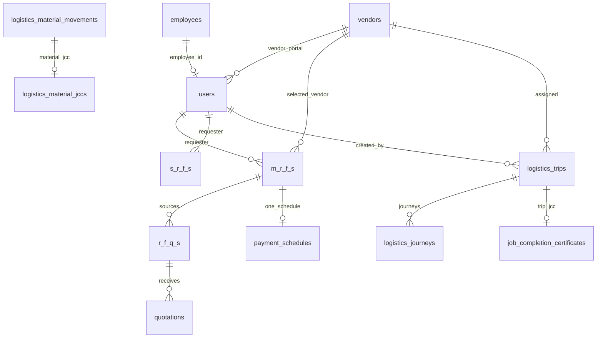
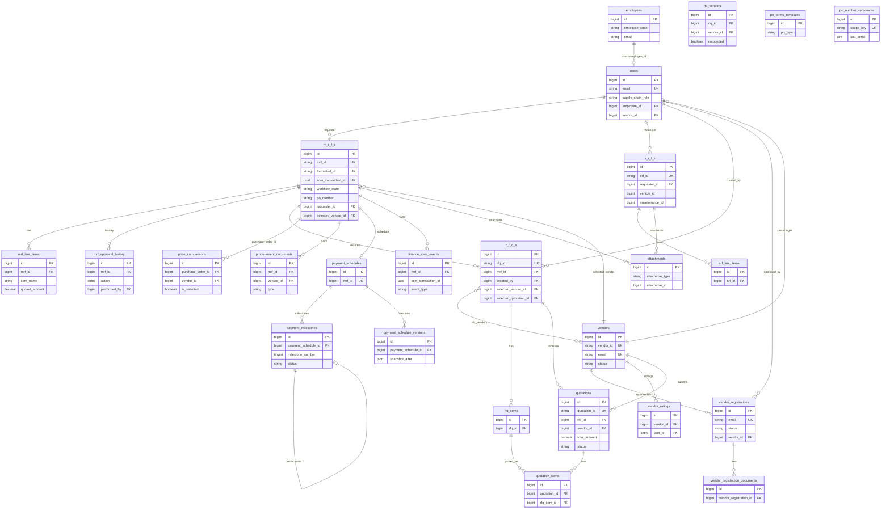
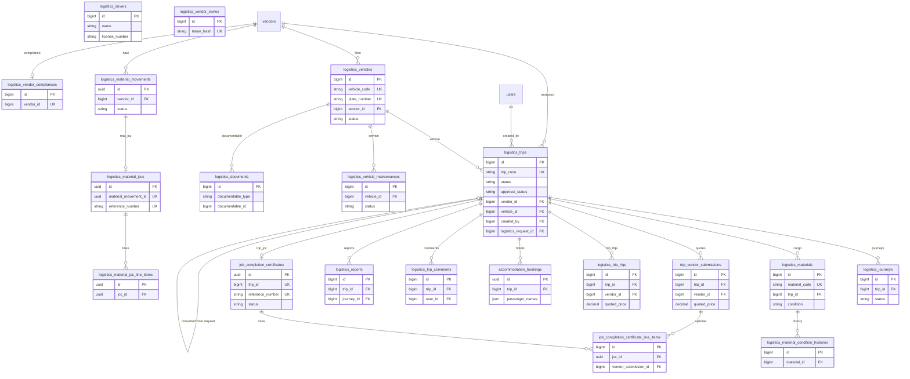
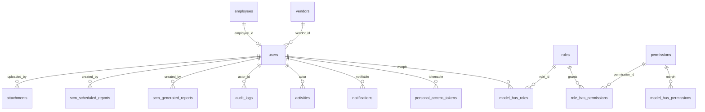

# Database Schema

PostgreSQL schema for the Emerald Supply Chain Management backend (Laravel). Reconstructed from Eloquent models and the full migration history.

There is **no separate purchase-orders table**. An approved MRF *is* the purchase order (`m_r_f_s.po_number`, PO PDFs, payment schedule, GRN, invoice).

The database is **shared with HRIS**. `users`, `employees`, and `audit_logs` are owned or co-owned by HRIS; SCM adds its own columns (notably `users.supply_chain_role`) and must not overwrite `users.hris_role`.

---

## Table naming conventions

### Defaults (Laravel)

| Rule | Example |
|---|---|
| `snake_case`, plural table names | `vendors`, `quotations`, `attachments` |
| Primary key `id` (bigint auto-increment) unless noted as UUID | `vendors.id` |
| Foreign keys `{singular_related}_id` | `requester_id`, `vendor_id`, `mrf_id` |
| Timestamps `created_at` / `updated_at` | almost every table |
| Pivot tables `{alpha}_{beta}` alphabetical-ish | `rfq_vendors` |

### Acronym tables (do not “fix” these)

Laravel’s `Str::snake(Str::plural('MRF'))` produces underscored letter names. Models override `$table` to match.

| Model | Table | Business id column |
|---|---|---|
| `MRF` | `m_r_f_s` | `mrf_id` (e.g. `MRF-2025-001`) plus `formatted_id` |
| `SRF` | `s_r_f_s` | `srf_id` plus `formatted_id` |
| `RFQ` | `r_f_q_s` | `rfq_id` plus `formatted_id` |

Child tables use the **acronym as a prefix**, not the parent table name:

- `mrf_line_items.mrf_id` → `m_r_f_s.id`
- `srf_line_items.srf_id` → `s_r_f_s.id`
- `rfq_items.rfq_id` → `r_f_q_s.id`
- `rfq_vendors.rfq_id` → `r_f_q_s.id`

### Domain prefixes

| Prefix | Domain | Examples |
|---|---|---|
| *(none)* | Procurement core | `m_r_f_s`, `vendors`, `quotations` |
| `logistics_` | Fleet, trips, warehouse materials | `logistics_trips`, `logistics_vehicles` |
| `scm_` | SCM reporting (avoid colliding with HRIS) | `scm_generated_reports` |
| `finance_` | Finance AP integration | `finance_sync_events` |
| `po_` | Purchase-order helpers | `po_terms_templates`, `po_number_sequences` |

**Exceptions (logistics entities without the prefix):** `job_completion_certificates`, `job_completion_certificate_line_items`, `trip_vendor_submissions`, `accommodation_bookings`, `trip_request_edits`.

### Line items vs items

| Table | Notes |
|---|---|
| `mrf_line_items` | Renamed from `mrf_items` |
| `srf_line_items` | Renamed from `srf_items` |
| `rfq_items` | **Not** renamed |
| `quotation_items` | **Not** renamed |
| `job_completion_certificate_line_items` | Trip / personnel JCC |
| `logistics_material_jcc_line_items` | Warehouse material JCC |

`quoted_total` and `quoted_amount` both exist on MRF/SRF line-item tables; application code uses `quoted_amount`.

### Identifiers

Many entities have **two ids**:

1. Surrogate PK `id` (bigint or UUID)
2. Human/business code: `mrf_id`, `srf_id`, `rfq_id`, `quotation_id`, `vendor_id`, `trip_code`, `vehicle_code`, `material_code`, `po_number`

Newer display ids live in `formatted_id` (unique, nullable). Cross-system finance id is `scm_transaction_id` (UUID on `m_r_f_s`).

`vendor_id` is overloaded:

- String business code on `vendors.vendor_id` (`V001`)
- Bigint FK named `vendor_id` on almost every other table → `vendors.id`

### Who / audit columns

Prefer `*_by` user FKs plus denormalized name/role when the audit trail must survive user edits:

- `created_by`, `updated_by`, `uploaded_by`, `approved_by`, `issued_by`, `reviewed_by`, `performed_by`, `submitted_by`, `cancelled_by`, `recorded_by`, `changed_by`
- Stage-specific: `executive_approved_by`, `chairman_approved_by`, `payment_approved_by`, `grn_requested_by`, …
- Denormalized: `requester_name`, `performer_name`, `vendor_name`

### Polymorphic file tables

| Table | Morph columns | Used by |
|---|---|---|
| `attachments` | `attachable_type` / `attachable_id` | MRF, SRF, accommodation bookings |
| `logistics_documents` | `documentable_type` / `documentable_id` | Vehicles, maintenance, drivers, vendor submissions, trip JCCs |

Vendor onboarding files are **not** polymorphic: `vendor_registration_documents`. Some records also keep a JSON `documents` / `attachments` / `supporting_documents` column as a fallback.

### Primary key types

| UUID PK (`$incrementing = false`) | Bigint PK |
|---|---|
| `notifications` | Almost everything else |
| `accommodation_bookings` | |
| `job_completion_certificates` | |
| `logistics_material_movements` | |
| `logistics_material_jccs` | |
| `logistics_material_jcc_line_items` | |

### Status casing

Inconsistent by domain — do not normalize in the database without a migration:

- Procurement enums: Title Case (`Pending`, `Approved`, `Open`)
- Trip workflow: lowercase snake (`draft`, `scd_review`, `converted`)
- Fleet vehicles/maintenance: `ACTIVE`, `UNDER_MAINTENANCE`, `SCHEDULED`
- JSON metadata / snapshots: mixed

### Singular table name

`mrf_approval_history` is singular (not `mrf_approval_histories`).

---

## Entity-relationship diagrams

### System overview

### Procurement, vendors, and payment

### Logistics, fleet, and warehouse

### Identity and platform

---

## Table inventory

| Table | Model | Domain |
|---|---|---|
| `users` | `User` | Identity (shared HRIS) |
| `employees` | `Employee` | Identity (shared HRIS, no SCM create migration) |
| `password_reset_tokens` | — | Laravel |
| `sessions` | — | Laravel |
| `personal_access_tokens` | Sanctum | Auth |
| `permissions` / `roles` / `model_has_permissions` / `model_has_roles` / `role_has_permissions` | Spatie | Auth |
| `notifications` | Laravel | Platform |
| `cache` / `cache_locks` | — | Laravel |
| `jobs` / `job_batches` / `failed_jobs` | — | Laravel |
| `audit_logs` | `AuditLog` | Platform (shared HRIS) |
| `activities` | `Activity` | Platform |
| `attachments` | `Attachment` | Platform |
| `department_codes` | — | Reference |
| `category_codes` | — | Reference |
| `id_sequences` | — | Reference |
| `scm_generated_reports` | `GeneratedReport` | Reporting |
| `scm_scheduled_reports` | `ScheduledReport` | Reporting |
| `m_r_f_s` | `MRF` | Procurement / PO |
| `mrf_line_items` | `MRFItem` | Procurement |
| `mrf_approval_history` | `MRFApprovalHistory` | Procurement |
| `s_r_f_s` | `SRF` | Procurement |
| `srf_line_items` | `SRFItem` | Procurement |
| `r_f_q_s` | `RFQ` | Procurement |
| `rfq_items` | `RFQItem` | Procurement |
| `rfq_vendors` | pivot | Procurement |
| `quotations` | `Quotation` | Procurement |
| `quotation_items` | `QuotationItem` | Procurement |
| `vendors` | `Vendor` | Vendors |
| `vendor_registrations` | `VendorRegistration` | Vendors |
| `vendor_registration_documents` | `VendorRegistrationDocument` | Vendors |
| `vendor_ratings` | `VendorRating` | Vendors |
| `price_comparisons` | `PriceComparison` | PO |
| `procurement_documents` | `ProcurementDocument` | PO |
| `po_terms_templates` | `POTermsTemplate` | PO |
| `po_number_sequences` | `PoNumberSequence` | PO |
| `payment_schedules` | `PaymentSchedule` | Payment |
| `payment_milestones` | `PaymentMilestone` | Payment |
| `payment_schedule_versions` | `PaymentScheduleVersion` | Payment |
| `finance_sync_events` | `FinanceSyncEvent` | Finance AP |
| `logistics_trips` | `Logistics\Trip` | Logistics |
| `logistics_journeys` | `Logistics\Journey` | Logistics |
| `logistics_vehicles` | `Logistics\Vehicle` | Fleet |
| `logistics_vehicle_maintenances` | `Logistics\VehicleMaintenance` | Fleet |
| `logistics_drivers` | `Logistics\FleetDriver` | Fleet |
| `logistics_materials` | `Logistics\Material` | Logistics |
| `logistics_material_condition_histories` | `Logistics\MaterialConditionHistory` | Logistics |
| `logistics_material_movements` | `Logistics\MaterialMovement` | Warehouse |
| `logistics_material_jccs` | `Logistics\MaterialJCC` | Warehouse |
| `logistics_material_jcc_line_items` | `Logistics\MaterialJCCLineItem` | Warehouse |
| `job_completion_certificates` | `Logistics\JobCompletionCertificate` | Logistics |
| `job_completion_certificate_line_items` | `Logistics\JCCLineItem` | Logistics |
| `trip_vendor_submissions` | `Logistics\TripVendorSubmission` | Logistics |
| `logistics_trip_rfqs` | `Logistics\TripRfq` | Logistics (**no create migration**) |
| `accommodation_bookings` | `Logistics\AccommodationBooking` | Logistics |
| `logistics_trip_comments` | `Logistics\TripComment` | Logistics |
| `trip_request_edits` | — | Logistics |
| `logistics_documents` | `Logistics\Document` | Logistics |
| `logistics_reports` | `Logistics\Report` | Logistics |
| `logistics_vendor_invites` | `Logistics\VendorInvite` | Logistics |
| `logistics_vendor_compliances` | `Logistics\VendorCompliance` | Logistics |
| `logistics_notification_events` | `Logistics\NotificationEvent` | Logistics |
| `logistics_idempotency_keys` | `Logistics\IdempotencyKey` | Logistics |
| `logistics_fleet_notification_dispatches` | `Logistics\FleetNotificationDispatch` | Fleet |

---

## Identity and platform

### `users` — `App\Models\User`

Staff, admins, and vendor-portal logins. Shared with HRIS.

| Column | Type | Notes |
|---|---|---|
| `id` | bigint PK | |
| `name` | string | |
| `email` | string unique | Lookups are case-insensitive in code |
| `role` | string, default `employee` | Legacy shared column |
| `hris_role` | string nullable | **HRIS-owned — do not write from SCM** |
| `supply_chain_role` | string nullable | SCM permission source |
| `department` | string nullable | indexed |
| `designated_requisition_creator` | boolean default false | Composite index with department |
| `signature_image_path` | string nullable | |
| `phone` | string nullable | |
| `employee_id` | bigint FK → `employees.id` nullable | HRIS |
| `vendor_id` | bigint FK → `vendors.id` SET NULL | Vendor portal |
| `must_change_password` | boolean | Pre-existing / HRIS |
| `password_changed_at` | timestamp nullable | |
| `is_admin` | boolean default false | |
| `can_manage_users` | boolean default false | |
| `email_verified_at` | timestamp nullable | |
| `password` | string hashed | |
| `remember_token` | string nullable | |
| `created_at`, `updated_at` | timestamps | |

**Relations:** `belongsTo` Employee, Vendor; `hasMany` MRF/SRF (`requester_id`), RFQ (`created_by`), Quotation (`approved_by`), VendorRegistration (`approved_by`); Spatie roles; Sanctum tokens; database notifications.

### `employees` — `App\Models\Employee`

Shared HRIS table (no SCM `Schema::create`). Inferred columns from fillable: `first_name`, `last_name`, `dob`, `gender`, `marital_status`, `nationality`, `phone`, `email`, `address`, `profile_picture`, `job_title`, `department`, `employment_type`, `grade_level`, `supervisor_name`, `work_location`, `hire_date`, `probation_period`, `confirmation_date`, `employment_status`, `vacation_days`, `employee_code`, timestamps.

**Relations:** `hasOne` User (`employee_id`).

### Laravel / Spatie tables

| Table | PK | Purpose |
|---|---|---|
| `password_reset_tokens` | `email` | Password reset |
| `sessions` | `id` string | Session driver |
| `cache` / `cache_locks` | `key` | Cache driver |
| `jobs` / `job_batches` / `failed_jobs` | mixed | Queue |
| `personal_access_tokens` | bigint | Sanctum. Morphs `tokenable`. `token` unique(64) |
| `notifications` | **UUID** | Database notifications. Morphs `notifiable`. `data` text JSON, `read_at` |
| `permissions` | bigint | Unique `(name, guard_name)` |
| `roles` | bigint | Unique `(name, guard_name)` |
| `model_has_permissions` | composite | `permission_id` + morph `model` |
| `model_has_roles` | composite | `role_id` + morph `model` |
| `role_has_permissions` | composite | role ↔ permission |

### `audit_logs` — `App\Models\AuditLog`

Create is skipped if the table already exists (HRIS).

| Column | Type |
|---|---|
| `id` | bigint PK |
| `action` | string(100) indexed |
| `description` | text nullable |
| `actor_id` | bigint nullable indexed |
| `actor_type` | string(100) nullable |
| `entity_type` | string(100) nullable indexed |
| `entity_id` | string(100) nullable indexed |
| `payload` | json nullable |
| `ip_address` | inet/ip nullable |
| `user_agent` | string(500) nullable |
| timestamps | |

### `activities` — `App\Models\Activity`

Activity feed. Columns: `type` string(50) indexed, `title`, `description` text nullable, `user_id` FK → `users` SET NULL, `user_name`, `entity_type` string(50) indexed, `entity_id` string(255) nullable, `status` string(50) nullable, `metadata` json, `created_at` (**no `updated_at`**).

### `attachments` — `App\Models\Attachment`

Polymorphic files for MRF, SRF, and accommodation bookings.

| Column | Type |
|---|---|
| `id` | bigint PK |
| `attachable_type`, `attachable_id` | morphs, indexed |
| `collection` | string(64) default `supporting_documents` |
| `disk` | string(64) |
| `file_path` | text |
| `file_name`, `original_name` | string |
| `mime_type` | string(150) nullable |
| `size` | unsigned bigint nullable |
| `uploaded_by` | FK → `users` SET NULL |
| `metadata` | json nullable |
| timestamps | |

**Relations:** `morphTo` attachable; `belongsTo` User.

### Reference tables (no Eloquent model)

**`department_codes`:** `id`, `department_name` string(100) unique, `code` string(8), timestamps. Seeded: Business Development/`BD`, Operations/`OPS`, Finance/`FIN`, IT/`IT`, Human Resources/`HR`, Procurement/`PRC`, Executive/`EXE`, Supply Chain/`SC`, Technical Operations/`TEO`.

**`category_codes`:** `id`, `category_name` string(100) unique, `code` string(8), `request_type` string(8) (`MRF`, `SRF`, …), timestamps. Index `(request_type, code)`.

**`id_sequences`:** `scope` string(64) **PK** (e.g. `MRF-2026`), `last_seq` unsigned int default 0, timestamps.

### Reporting

**`scm_generated_reports`** (`GeneratedReport`): `id`, `name`, `report_type` string(64), `format` string(16) default `csv`, `status` string(32) default `completed`, `file_size_bytes`, `storage_path`, `filters` json, `created_by` FK → `users` SET NULL, `completed_at`, timestamps.

**`scm_scheduled_reports`** (`ScheduledReport`): `id`, `name`, `report_type`, `format`, `frequency` string(32), `filters` json, `recipient_user_ids` json, `is_active` boolean default true, `next_run_at`, `last_run_at`, `created_by` FK → `users`, timestamps.

---

## Procurement

### `m_r_f_s` — `App\Models\MRF`

Material Requisition Form **and** the purchase-order record.

**Unique:** `mrf_id`, `formatted_id`, `scm_transaction_id`.

| Column | Type | Notes |
|---|---|---|
| `id` | bigint PK | |
| `mrf_id` | string unique | e.g. `MRF-2025-001` |
| `formatted_id` | string(64) unique nullable | Display id |
| `scm_transaction_id` | uuid unique NOT NULL | Finance AP correlation |
| `source` | string(32) default `standard` | Manual PO origin |
| `is_po_linked` | boolean default false | |
| `linked_po_id` | string(64) nullable | |
| `finance_ap_case_id` | string(64) nullable indexed | |
| `finance_ap_status` | string(50) nullable | |
| `title` | string | |
| `category` | string | |
| `contract_type` | string(100) nullable | `emerald`, `oando`, `dangote`, `heritage`, or custom |
| `routed_reason` | string(100) nullable | `standard_contract_type`, `custom_contract_type`, `logistics_exception` |
| `urgency` | enum `Low\|Medium\|High\|Critical` default `Medium` | |
| `description` | text | |
| `quantity` | string | Header leftover; line items are canonical |
| `estimated_cost` | decimal(15,2) nullable | |
| `po_value` | decimal(15,2) nullable | |
| `currency` | string(3) default `NGN` | |
| `justification` | text | |
| `pfi_url`, `pfi_share_url` | text nullable | |
| `attachment_url`, `attachment_share_url` | text nullable | Plus polymorphic `attachments` |
| `attachment_name` | string nullable | |
| `requester_id` | FK → `users` CASCADE | |
| `requester_name` | string | denormalized |
| `department` | string nullable | |
| `date` | date | |
| `status` | string/enum | Originally Title Case; code also writes lowercase |
| `current_stage` | string default `procurement` | |
| `workflow_state` | string + PG check | See list below |
| `first_approval_by_role` | string(50) nullable | Parallel first approval |
| `last_action_by_role` | string nullable | |
| `approval_history` | json nullable | Legacy; live history is `mrf_approval_history` |
| `rejection_reason`, `rejection_comments` | text nullable | |
| `rejected_by` | FK → `users` nullable | |
| `rejected_at` | timestamp nullable | |
| `is_resubmission` | boolean default false | |
| `previous_submission_id` | FK → `m_r_f_s.id` nullable | |
| `remarks` | text nullable | |
| `executive_approved` | boolean default false | |
| `executive_approved_by` | FK → `users` nullable | |
| `executive_approved_at` | timestamp nullable | |
| `executive_remarks` | text nullable | |
| `chairman_approved` | boolean default false | |
| `chairman_approved_by` | FK → `users` nullable | |
| `chairman_approved_at` | timestamp nullable | |
| `chairman_remarks` | text nullable | |
| `director_approved_by` | **string** nullable | Not a FK (may store a name or a user id) |
| `director_approved_at` | timestamp nullable | |
| `director_remarks` | text nullable | |
| `procurement_review_started_at` | timestamp nullable | |
| `procurement_approved_at` | timestamp nullable | |
| `scd_approved_at` | timestamp nullable | |
| `finance_approved_at` | timestamp nullable | |
| `rfq_issued_at`, `quotation_received_at` | timestamp nullable | |
| `selected_vendor_id` | FK → `vendors` SET NULL | |
| `procurement_manager_id` | FK → `users` SET NULL | |
| `po_number` | string nullable indexed | `PO-DDMMYY-SupplierToken-NNNN` |
| `po_version` | integer default 1 | |
| `po_generated_at`, `po_signed_at`, `po_draft_saved_at` | timestamp nullable | |
| `po_generation_error` | text nullable | |
| `po_generation_failed_at` | timestamp nullable | |
| `unsigned_po_url`, `unsigned_po_share_url` | text nullable | |
| `signed_po_url`, `signed_po_share_url` | text nullable | |
| `ship_to_address` | text nullable | |
| `tax_rate` | decimal(5,2) default 0 | |
| `tax_amount` | decimal(15,2) default 0 | |
| `po_special_terms` | text nullable | |
| `custom_terms` | longText nullable | |
| `po_terms_mode` | string(20) nullable | |
| `po_type` | string(32) nullable | |
| `po_payment_terms` | text nullable | |
| `invoice_submission_email`, `invoice_submission_cc` | string nullable | |
| `invoice_url`, `invoice_share_url` | text nullable | |
| `invoice_approved_by` | FK → `users` SET NULL | |
| `invoice_approved_at` | timestamp nullable | |
| `invoice_remarks` | text nullable | |
| `expected_delivery_date` | date nullable | |
| `payment_status` | string nullable | |
| `payment_approved_at`, `payment_processed_at` | timestamp nullable | |
| `payment_approved_by` | FK → `users` nullable | |
| `grn_requested` / `grn_completed` | boolean default false | |
| `grn_requested_at` / `grn_completed_at` | timestamp nullable | |
| `grn_requested_by` / `grn_completed_by` | FK → `users` nullable | |
| `grn_url`, `grn_share_url` | text nullable | |
| timestamps | | |

**`workflow_state` check constraint values:**

`mrf_created`, `parallel_first_approval`, `supply_chain_director_review`, `supply_chain_director_approved`, `supply_chain_director_rejected`, `lazarus_director_approval`, `procurement_review`, `procurement_approved`, `rfq_issued`, `quotations_received`, `quotations_evaluated`, `po_generated`, `po_signed`, `delivery_confirmation_pending`, `delivery_confirmation_complete`, `finance_handoff_pending`, `finance_in_review`, `milestone_payment_in_progress`, `financially_complete`, `operationally_complete`, `closed`, `executive_review`, `executive_approved`, `executive_rejected`, `vendor_selected`, `invoice_received`, `invoice_approved`, `payment_processed`, `grn_requested`, `grn_completed`.

**Relations:** `belongsTo` requester, executive/chairman/director/rejector/payment/invoice approvers, selected vendor, procurement manager, previous MRF; `hasMany` RFQs, line items, approval history, price comparisons, procurement documents; `hasOne` payment schedule; `hasManyThrough` quotations via RFQ; `morphMany` Attachment.

There is **no** `m_r_f_s.payment_milestones` column. Structured milestones live in `payment_schedules` / `payment_milestones`.

### `mrf_line_items` — `App\Models\MRFItem`

Renamed from `mrf_items`.

| Column | Type |
|---|---|
| `id` | bigint PK |
| `mrf_id` | FK → `m_r_f_s` CASCADE indexed |
| `item_name` | string |
| `description` | text nullable |
| `quantity` | integer |
| `unit` | string(50) |
| `unit_price` | decimal(15,2) nullable |
| `total_price` | decimal(15,2) nullable |
| `budget_amount` | decimal(15,2) nullable |
| `quoted_total` | decimal(15,2) nullable | leftover |
| `quoted_amount` | decimal(15,2) nullable | canonical |
| `specifications` | text nullable |
| timestamps | |

### `mrf_approval_history` — `App\Models\MRFApprovalHistory`

Singular table name. `id`, `mrf_id` FK CASCADE, `action` (check), `stage` string(50), `performed_by` FK → `users`, `performer_name`, `performer_role` string(100), `remarks` text, timestamps.

**`action` values:** `approved`, `rejected`, `returned`, `generated_po`, `signed_po`, `rejected_po`, `payment_processed`, `payment_approved`, `vendor_selected`, `vendor_approved`, `vendor_rejected`, `po_deleted`.

### `s_r_f_s` — `App\Models\SRF`

Service Requisition Form, including fleet-triggered work.

| Column | Type | Notes |
|---|---|---|
| `id` | bigint PK | |
| `srf_id` | string unique | |
| `formatted_id` | string(64) unique nullable | |
| `title` | string | |
| `service_type` | string | |
| `contract_type` | string nullable | |
| `urgency` | enum `Low\|Medium\|High\|Critical` default `Medium` | |
| `description` | text | |
| `duration` | string | |
| `estimated_cost` | decimal(15,2) nullable | |
| `justification` | text | |
| `vehicle_id` | bigint nullable indexed | **no FK constraint** |
| `maintenance_id` | bigint nullable indexed | **no FK constraint** |
| `vehicle_snapshot` | json nullable | |
| `maintenance_history` | json nullable | |
| `rfq_prefill` | json nullable | |
| `origin` | string(60) nullable | `fleet_dashboard`, `employee`, `logistics_manager`, … |
| `payment_milestones` | json nullable | SRF-only JSON; not the `payment_milestones` table |
| `requester_id` | FK → `users` CASCADE | |
| `requester_name` | string | |
| `department` | string nullable | |
| `date` | date | |
| `status` | enum `Pending\|Approved\|Rejected\|In Progress\|Completed` default `Pending` | |
| `current_stage` | string default `procurement` | |
| `approval_history` | json nullable | |
| `rejection_reason` | text nullable | |
| `remarks` | text nullable | |
| timestamps | | |

**Relations:** `belongsTo` User, Vehicle, VehicleMaintenance; `hasMany` SRFItem; `morphMany` Attachment.

### `srf_line_items` — `App\Models\SRFItem`

Renamed from `srf_items`. `id`, `srf_id` FK → `s_r_f_s` CASCADE, `item_name`, `description`, `quantity` integer default 1, `unit` string(50) default `unit`, `budget_amount`, `quoted_total`, `quoted_amount`, `unit_price`, `total_price` decimal(15,2) nullable, `specifications` text nullable, timestamps.

### `r_f_q_s` — `App\Models\RFQ`

| Column | Type | Notes |
|---|---|---|
| `id` | bigint PK | |
| `rfq_id` | string unique | |
| `formatted_id` | string(64) unique nullable | |
| `mrf_id` | FK → `m_r_f_s` CASCADE nullable indexed | |
| `mrf_title` | string nullable | denormalized |
| `title` | string nullable | |
| `category` | string nullable | |
| `description` | text | |
| `quantity` | string | |
| `estimated_cost` | decimal(15,2) nullable | |
| `deadline` | date | |
| `payment_terms`, `delivery_terms` | text nullable | |
| `technical_requirements`, `notes`, `additional_notes`, `terms_and_conditions` | text nullable | |
| `supporting_documents` | json nullable | |
| `status` | enum `Open\|Closed\|Awarded\|Cancelled` default `Open` | |
| `workflow_state` | string(50) default `draft` | check: `draft`, `open`, `quotation_received`, `procurement_review`, `supply_chain_review`, `approved`, `rejected`, `closed` |
| `selected_vendor_id` | FK → `vendors` nullable | |
| `selected_quotation_id` | FK → `quotations` nullable | |
| `created_by` | FK → `users` CASCADE | |
| timestamps | | |

**Relations:** `belongsTo` MRF, User, selected Vendor, selected Quotation; `belongsToMany` Vendor via `rfq_vendors` (pivot: `sent_at`, `viewed_at`, `responded`, `responded_at`); `hasMany` items, quotations.

### `rfq_items` — `App\Models\RFQItem`

`id`, `rfq_id` FK CASCADE indexed, `item_name`, `description` text nullable, `quantity` integer, `unit` string(50), `specifications` text nullable, timestamps.

### `rfq_vendors` — pivot (no model)

`id`, `rfq_id` FK → `r_f_q_s`, `vendor_id` FK → `vendors`, unique `(rfq_id, vendor_id)`, `sent_at`, `viewed_at`, `responded` boolean default false, `responded_at`, timestamps.

### `quotations` — `App\Models\Quotation`

| Column | Type |
|---|---|
| `id` | bigint PK |
| `quotation_id` | string unique (`QUO-YYYY-NNN`) |
| `rfq_id` | FK → `r_f_q_s` nullable |
| `vendor_id` | FK → `vendors` nullable |
| `vendor_name` | string denormalized |
| `quote_number` | string nullable |
| `price` | decimal(15,2) | legacy header |
| `total_amount` | decimal(15,2) |
| `currency` | string(3) default `NGN` |
| `delivery_days` | integer nullable |
| `delivery_date` | date nullable |
| `payment_terms` | string nullable |
| `validity_days` | integer default 30 |
| `warranty_period` | string(100) nullable |
| `attachments` | json nullable |
| `notes`, `evaluation_notes` | text nullable |
| `evaluation_score` | decimal(4,1) nullable |
| `evaluation_updated_at` | timestamp nullable |
| `status` | enum `Pending\|Approved\|Rejected` default `Pending` |
| `review_status` | string(50) default `pending` (`pending`, `under_review`, `approved`, `rejected`, `revision_requested`) |
| `rejection_reason`, `revision_notes`, `approval_remarks` | text nullable |
| `approved_by` | FK → `users` SET NULL |
| `approved_at`, `submitted_at`, `reviewed_at` | timestamp nullable |
| `reviewed_by` | FK → `users` SET NULL |
| timestamps | |

Quotations reach an MRF **through RFQ** (`hasManyThrough`). There is no `quotations.mrf_id` column.

### `quotation_items` — `App\Models\QuotationItem`

`id`, `quotation_id` FK CASCADE, `rfq_item_id` FK → `rfq_items` SET NULL, `item_name`, `description`, `quantity` integer, `unit` string(50), `unit_price` decimal(15,2), `total_price` decimal(15,2), `specifications` text nullable, timestamps.

---

## Vendors

### `vendors` — `App\Models\Vendor`

| Column | Type |
|---|---|
| `id` | bigint PK |
| `vendor_id` | string unique (`V001`) |
| `name` | string |
| `category` | string |
| `category_other` | string(500) nullable |
| `rating` | decimal(3,2) nullable default 0 |
| `total_orders` | integer default 0 |
| `completed_orders` | unsigned int default 0 |
| `on_time_deliveries` | unsigned int default 0 |
| `status` | enum `Active\|Inactive\|Pending\|Suspended` default `Pending` |
| `email` | string unique |
| `phone`, `alternate_phone` | string nullable |
| `bank_name`, `account_name` | string(255) nullable |
| `account_number` | string(64) nullable |
| `address` | text nullable |
| `city`, `state`, `postal_code` | string nullable |
| `country_code` | string(2) nullable |
| `tax_id`, `website` | string nullable |
| `year_established` | integer nullable |
| `number_of_employees` | string nullable |
| `annual_revenue` | string(255) nullable |
| `contact_person`, `contact_person_title`, `contact_person_email`, `contact_person_phone` | string nullable |
| `notes` | text nullable |
| `profile_completed` | boolean default true |
| `onboarding_source` | string(32) nullable |
| `onboarding_email_sent_at` | timestamp nullable |
| timestamps | |

**Relations:** `belongsToMany` RFQ; `hasMany` quotations, registrations, ratings, users.

### `vendor_registrations` — `App\Models\VendorRegistration`

Onboarding applications. `id`, `company_name`, `category`, `category_other`, `email` unique, `phone`, `address`, `country_code`, `bank_name`, `account_number`, `account_name`, `currency` string(3), `annual_revenue`, `number_of_employees`, `year_established`, `tax_id`, `contact_person`, `website`, `documents` json, `temp_password`, `password_changed_at`, `status` enum `Pending\|Approved\|Rejected` default `Pending`, `rejection_reason`, `approval_remarks`, `approved_by` FK SET NULL, `approved_at`, `vendor_id` FK → `vendors` nullable, timestamps.

`account_balance` was added then dropped.

### `vendor_registration_documents` — `App\Models\VendorRegistrationDocument`

`id`, `vendor_registration_id` FK CASCADE, `file_path`, `file_name`, `file_type`, `file_size`, `file_url`, `file_share_url`, `uploaded_at`, `expiry_date` datetime nullable, `is_required` boolean default false, `status` enum `Pending\|Approved\|Rejected\|Expired` default `Pending`, timestamps.

### `vendor_ratings` — `App\Models\VendorRating`

`id`, `vendor_id` FK CASCADE, `user_id` FK CASCADE, `rating` decimal(2,1), `comment` text nullable, timestamps.

---

## Purchase order helpers and payment

### `price_comparisons` — `App\Models\PriceComparison`

`id`, `purchase_order_id` FK → **`m_r_f_s`** CASCADE, `vendor_id` FK CASCADE, `item_description` text, `unit_price` decimal(15,2), `quantity` decimal(15,2), `total_price` decimal(15,2), `is_selected` boolean default false, `selection_reason` text nullable, timestamps.

### `procurement_documents` — `App\Models\ProcurementDocument`

`id`, `mrf_id` FK CASCADE, `vendor_id` FK SET NULL, `type` string(50) (`vendor_invoice`, `grn`, `waybill`, `jcc`, `pfi`, `po_pdf`, `signed_po`, `delivery_confirmation`, `other`), `file_name`, `file_path`, `file_url`, `uploaded_by` FK SET NULL, `uploaded_at`, `version` unsigned int default 1, `is_active` boolean default true, `metadata` json, timestamps.

Partial unique index: one active vendor invoice per `(mrf_id, vendor_id)`.

### `po_terms_templates` — `App\Models\POTermsTemplate`

`id`, `po_type` check `goods|services|logistics|rfq`, `content` longText, `is_active` boolean default true, timestamps.

### `po_number_sequences` — `App\Models\PoNumberSequence`

`id`, `scope_key` string unique (`{DDMMYY}|{SupplierToken}`), `last_serial` unsigned int default 0, timestamps. See `docs/po-numbering-spec.md`.

### `payment_schedules` — `App\Models\PaymentSchedule`

One schedule per MRF. `id`, `mrf_id` **unique** FK CASCADE, `template_name`, `total_percentage_check` decimal(5,2) default 100, `created_by` FK SET NULL, `approved_at`, `locked_at`, `version` unsigned int default 1, timestamps.

### `payment_milestones` — `App\Models\PaymentMilestone`

`id`, `payment_schedule_id` FK CASCADE, `milestone_number` unsigned tinyint, unique `(payment_schedule_id, milestone_number)`, `label`, `percentage` decimal(5,2), `amount` decimal(15,2) nullable, `trigger_condition` string(50) (`on_advance`, `upon_delivery`, `upon_completion`), `required_documents` json, `status` string(30) default `pending` (`pending`, `payment_requested`, `paid`, `complete`), `paid_amount` decimal(15,2) default 0, `paid_at`, `finance_ap_reference`, `predecessor_milestone_id` FK self SET NULL, timestamps.

### `payment_schedule_versions` — `App\Models\PaymentScheduleVersion`

`id`, `payment_schedule_id` FK CASCADE, `version`, `changed_by` FK SET NULL, `snapshot_before` json, `snapshot_after` json, `created_at` only.

### `finance_sync_events` — `App\Models\FinanceSyncEvent`

`id`, `mrf_id` FK SET NULL, `scm_transaction_id` uuid nullable, `direction` string(16) (`outbound`/`inbound`), `event_type` string(64), `idempotency_key` unique nullable, `correlation_id` string(64), `payload_hash` string(64), `request_payload` json, `response_payload` json, `http_status` unsigned smallint, `status` string(20) default `pending` (`pending`/`success`/`failed`), `error_message` text, `processed_at`, timestamps.

---

## Logistics and fleet

### `logistics_trips` — `App\Models\Logistics\Trip`

Trip **requests** and converted logistics jobs share this table. Self-FK `logistics_request_id` points at the originating request after conversion.

| Column | Type | Notes |
|---|---|---|
| `id` | bigint PK | |
| `trip_code` | string unique | |
| `trip_type` | string(50) default `personnel` | `personnel`, `material`, `mixed` |
| `booking_scope` | string(32) nullable | `within_state`, `out_of_state_local`, `international` |
| `international_transport_mode` | string(16) nullable | `flight`, `road` |
| `priority` | string(50) default `normal` | `low`, `normal`, `high`, `urgent` |
| `title` | string | |
| `description`, `purpose` | text nullable | |
| `status` | string(50) indexed | see constants below |
| `approval_status` | string(50) default `draft` | `DRAFT`, `PENDING_REVIEW`, `APPROVED`, `REJECTED` (also lowercase) |
| `workflow_stage` | string(50) default `trip_request` | |
| `scheduled_departure_at`, `scheduled_arrival_at` | timestamp nullable | |
| `actual_departure_at`, `actual_arrival_at` | timestamp nullable | |
| `cancelled_at` | timestamp nullable | |
| `cancelled_by` | FK → `users` SET NULL | |
| `origin`, `destination` | string | |
| `vendor_id` | FK → `vendors` SET NULL | |
| `vehicle_id` | FK → `logistics_vehicles` SET NULL | |
| `multi_vendor` | boolean default false | |
| `selected_vendor_id` | FK → `vendors` SET NULL | |
| `quotation_required` | boolean default false | |
| `logistics_request_id` | FK → `logistics_trips.id` SET NULL | converted-from |
| `passenger_user_ids` | json nullable | |
| `external_passengers` | json nullable | |
| `driver_user_id` | FK → `users` SET NULL | |
| `external_driver` | json nullable | `{name, phone, license_number}` |
| `driver_name`, `driver_phone`, `driver_licence` | string nullable | |
| `driver_source` | string default `system` | |
| `po_number` | string(100) nullable | |
| `unsigned_po_url`, `signed_po_url` | string(500) nullable | |
| `created_by`, `updated_by` | FK → `users` SET NULL | |
| `notes` | text nullable | |
| `accommodation_required` | boolean default false | |
| `accommodation_name`, `accommodation_address`, `accommodation_contact` | string nullable | |
| `accommodation_details` | text nullable | |
| `accommodation_estimated_cost` | decimal(12,2) nullable | |
| `escort_required` | boolean default false | |
| `escort_description` | text nullable | |
| `estimated_cost` | decimal(12,2) nullable | |
| `comments` | text nullable | |
| `submitted_at` | timestamp nullable | |
| `logistics_recommendation` | text nullable | |
| `escort_personnel_count` | smallint nullable | |
| `metadata` | json nullable | |
| timestamps | | |

**Status constants:** `draft`, `submitted`, `logistics_review`, `rfq_pending`, `rfq_received`, `scd_review`, `scd_approved`, `scd_rejected`, `procurement_pending`, `po_created`, `journey_active`, `scheduled`, `vendor_assigned`, `in_progress`, `completed`, `closed`, `cancelled`, `converted`, `converted_to_journey`.

**Relations:** `belongsTo` Vendor (`vendor_id`, `selected_vendor_id`), Vehicle, User (`created_by`, `driver_user_id`); `hasMany` Journey, Material, Report, TripVendorSubmission, TripRfq, AccommodationBooking, TripComment; `hasOne` JobCompletionCertificate.

### `logistics_journeys` — `App\Models\Logistics\Journey`

Originally a slim child of trips; later columns add request-like fields for converted journeys.

**Core:** `id`, `trip_id` FK CASCADE, `status` string(50), `departed_at`, `arrived_at`, `last_checkpoint_at`, `last_checkpoint_location`, `vendor_status`, `created_by` / `updated_by` FK SET NULL, `metadata` json, timestamps.

**Later columns (presence depends on which migrations ran):** `trip_request_id` FK → `logistics_trips` SET NULL, `trip_code`, `title`, `origin`, `destination`, `scheduled_departure_at`, `scheduled_arrival_at`, `driver_name`, `driver_phone`, `driver_email`, `driver_id`, `driver_source`, `vendor_id`, `vehicle_id`, `vehicle_plate_number`, `vehicle_make`, `vehicle_model`, `departure_time`, `expected_arrival_time`, `actual_departure_time`, `actual_arrival_time`, accommodation fields, `escort_required`, `escort_type`, `escort_description`, `passengers` json, `purpose`, `departure_location`, `destination_detail`, `feedback`, `feedback_triggered`, `jcc_generated`, `jcc_document_id` FK → `logistics_documents`.

**Relations:** `belongsTo` Trip (`trip_id` and `trip_request_id`), User (`created_by`).

### `logistics_vehicles` — `App\Models\Logistics\Vehicle`

| Column | Type | Notes |
|---|---|---|
| `id` | bigint PK | |
| `vehicle_code` | string unique | |
| `name` | string nullable | |
| `plate_number` | string unique | |
| `type` | string(100) nullable | |
| `make_model` | string nullable | |
| `make` | string(100) nullable | |
| `model` | string nullable | |
| `year` | integer nullable | |
| `color` | string nullable | |
| `ownership` | string nullable | accessor `ownership_type` |
| `fuel_type` | string nullable | |
| `capacity` | decimal(10,2) nullable | cargo; accessor `cargo_capacity` |
| `passenger_capacity` | unsigned smallint nullable | |
| `cargo_capacity` | string nullable | extra column; UI uses `capacity` |
| `status` | string(50) | `ACTIVE`, `INACTIVE`, `UNDER_MAINTENANCE` |
| `approval_status` | string nullable | |
| `status_inactive_reason` | string(50) nullable | `DOCUMENT_EXPIRED`, `MAINTENANCE_OVERDUE` |
| `vendor_id` | FK → `vendors` SET NULL | |
| `gps_device_id` | string nullable | |
| `last_service_at` | timestamp nullable | |
| `metadata` | json nullable | |
| timestamps | | |

**Relations:** `belongsTo` Vendor; `hasMany` VehicleMaintenance; `morphMany` Document.

### `logistics_vehicle_maintenances` — `App\Models\Logistics\VehicleMaintenance`

`id`, `vehicle_id` FK CASCADE, `maintenance_type` string(100), `interval_months` unsigned tinyint nullable, `description` text, `performed_at`, `next_due_at`, `cost` decimal(12,2), `performed_by` FK SET NULL, `status` (`SCHEDULED` / `COMPLETED` / `OVERDUE`), `metadata` json, timestamps. `morphMany` Document.

### `logistics_drivers` — `App\Models\Logistics\FleetDriver`

`id`, `name`, `email` nullable, `phone_number` string(20), `license_number` nullable, `metadata` json, timestamps. `morphMany` Document.

### `logistics_materials` — `App\Models\Logistics\Material`

`id`, `material_code` unique, `name`, `description`, `trip_id` FK SET NULL, `quantity` decimal(12,3) default 0, `unit` string(50), `condition` string(50), `status` string(50), `metadata` json, timestamps.

### `logistics_material_condition_histories` — `App\Models\Logistics\MaterialConditionHistory`

`id`, `material_id` FK CASCADE, `condition` string(50), `notes` text, `recorded_at`, `recorded_by` FK SET NULL, timestamps.

### `logistics_material_movements` — `App\Models\Logistics\MaterialMovement`

**UUID PK.** Warehouse haul (distinct from trip-linked `logistics_materials`).

`material_name`, `quantity` integer, `category`, `pickup_location`, `destination`, `vendor_id` FK SET NULL, `vendor_name`, `vendor_phone`, `vehicle_plate_number`, `driver_name`, `driver_phone`, `expected_pickup_datetime`, `expected_delivery_datetime`, `actual_pickup_datetime`, `actual_delivery_datetime`, `condition_of_goods` enum `new|used|damaged` default `new`, `status` enum `pending|in_transit|delivered|cancelled` default `pending`, `created_by` FK CASCADE, `updated_by` FK SET NULL, timestamps.

### `logistics_material_jccs` / `logistics_material_jcc_line_items`

Warehouse job-completion certificates. **UUID PKs.** One JCC per material movement (`material_movement_id` unique). Line items unique on `(jcc_id, serial_number)`.

Material JCC columns: `reference_number` unique, `vendor_id` FK SET NULL, `vendor_name`, `po_number` indexed, `certification_text`, `condition_on_arrival` enum `good|damaged|partial` default `good`, `status` enum `draft|submitted|approved` default `draft`, `issued_by` FK CASCADE, `issued_at`, `approved_by` FK SET NULL, `approved_at`, timestamps.

### `job_completion_certificates` — `App\Models\Logistics\JobCompletionCertificate`

**UUID PK.** Trip-level JCC (personnel/service), distinct from material JCCs. `trip_id` unique FK CASCADE.

Columns: `reference_number` unique nullable, `issued_by` FK → `users`, `issued_at`, `remarks`, `delivery_confirmed` boolean, `condition_of_goods` text, `attachments` json, `status` string(50) default `draft` (`draft|submitted|approved`), `approval_remarks`, `approved_by` FK SET NULL, `approved_at`, `currency` string(3) default `NGN`, `subtotal` / `vat` / `total_amount` decimal(15,2), `date_issued` date, `metadata` json, timestamps.

**Relations:** `belongsTo` Trip, Vendor, User (`issued_by` / `approved_by`); `hasMany` JCCLineItem; `morphMany` Document.

### `job_completion_certificate_line_items` — `App\Models\Logistics\JCCLineItem`

`id` bigint, `jcc_id` uuid FK CASCADE, `line_number`, `description`, `item_type` string(50) (`vehicle`, `service`, `material`, `other`), `details`, `condition`, `remarks`, `reference_number`, `vendor_submission_id` FK SET NULL, `unit`, `quantity` decimal(12,2), `unit_price` / `amount` decimal(15,2), `metadata` json, timestamps.

### `trip_vendor_submissions` — `App\Models\Logistics\TripVendorSubmission`

`id`, `trip_id` FK CASCADE, `vendor_id` FK CASCADE, unique `(trip_id, vendor_id)`, vehicle/driver fields (nullable), `security_info` text, `quoted_price` decimal(15,2), `currency` string(3) default `NGN`, `status` string(50) default `pending` (`pending|submitted|approved|rejected`), `submitted_at`, `rejection_reason`, `submitted_by` FK SET NULL, `metadata` json, timestamps. `morphMany` Document.

### `logistics_trip_rfqs` — `App\Models\Logistics\TripRfq`

Model exists (`protected $table = 'logistics_trip_rfqs'`) but **there is no `Schema::create` migration**. Intended columns from fillable: `trip_id`, `vendor_id`, `service_type`, `details` json, `status`, `quoted_price`, `currency`, `vendor_notes`, `document_url`, `valid_until`, `is_recommended`, `logistics_recommendation_note`, `scd_approved`, `scd_approved_at`, `sent_at`, `responded_at`, `created_by`, timestamps.

### `accommodation_bookings` — `App\Models\Logistics\AccommodationBooking`

**UUID PK.** Soft deletes. `trip_id` FK SET NULL, `passenger_names` json, `destination_state`, `destination_city`, `number_of_nights`, `hotel_name`, `check_in_date` date, `check_out_date` date nullable, `created_by` FK → `users`, `updated_by` FK SET NULL, timestamps, `deleted_at`. `morphMany` Attachment.

### `logistics_trip_comments` — `App\Models\Logistics\TripComment`

`id`, `trip_id` FK CASCADE, `user_id` FK CASCADE, `body` text, timestamps. Index `(trip_id, created_at)`.

### `trip_request_edits` — no Eloquent model

Audit log for trip-request field edits: `id`, `trip_request_id` FK → `logistics_trips` CASCADE, `edited_by` FK → `users` SET NULL, `field_name`, `original_value`, `new_value`, `reason`, timestamps.

Written via `TripRequestEditAuditService` (`DB::table(...)`). The original create lives in `2026_07_21_000001`, which **returns early on PostgreSQL** after adding three trip columns — confirm this table exists in each environment.

### Other logistics tables

| Table | Model | Columns (summary) |
|---|---|---|
| `logistics_documents` | `Document` | morphs `documentable`, `document_type`, `file_path`, `file_name`, `mime_type`, `size`, `expires_at`, `issued_at`, `uploaded_by`, `is_active`, `metadata` |
| `logistics_reports` | `Report` | `trip_id`, `journey_id`, `report_type`, `status`, `submitted_at`, `payload` json, `created_by` |
| `logistics_vendor_invites` | `VendorInvite` | `email`, `vendor_name`, `token_hash` unique, `expires_at`, `accepted_at`, `created_by` (no FK), `metadata` |
| `logistics_vendor_compliances` | `VendorCompliance` | `vendor_id` unique FK CASCADE, `status` default `pending`, `metadata`, `reviewed_at` |
| `logistics_notification_events` | `NotificationEvent` | `event_key` unique, `type`, `payload` json, `status`, `attempts`, `last_error`, `next_retry_at` |
| `logistics_idempotency_keys` | `IdempotencyKey` | `key` unique, `user_id`, `route`, `response` json, `status_code` |
| `logistics_fleet_notification_dispatches` | `FleetNotificationDispatch` | unique `(subject_type, subject_id, channel, period_key)` |

---

## Eloquent relationship map

### Procurement

- **User** → `hasMany` MRF/SRF (`requester_id`), RFQ (`created_by`), Quotation (`approved_by`), VendorRegistration (`approved_by`); `belongsTo` Employee, Vendor
- **MRF** → `hasMany` RFQ, MRFItem, MRFApprovalHistory, PriceComparison, ProcurementDocument; `hasOne` PaymentSchedule; `hasManyThrough` Quotation via RFQ; `morphMany` Attachment
- **RFQ** → `belongsToMany` Vendor via `rfq_vendors`; `hasMany` RFQItem, Quotation
- **Quotation** → `belongsTo` RFQ, Vendor; `hasMany` QuotationItem
- **PaymentSchedule** → `hasMany` PaymentMilestone, PaymentScheduleVersion
- **PaymentMilestone** → `belongsTo` predecessor (self)

### Logistics

- **Trip** → `hasMany` Journey, Material, Report, TripVendorSubmission, TripRfq, AccommodationBooking, TripComment; `hasOne` JobCompletionCertificate
- **Vehicle** → `hasMany` VehicleMaintenance; `morphMany` Document
- **MaterialMovement** → `hasOne` MaterialJCC → `hasMany` MaterialJCCLineItem
- **JobCompletionCertificate** → `hasMany` JCCLineItem; `morphMany` Document
- **Document** → `morphTo` documentable (Vehicle, VehicleMaintenance, FleetDriver, TripVendorSubmission, JobCompletionCertificate)
- **Attachment** → `morphTo` attachable (MRF, SRF, AccommodationBooking)

---

## Schema caveats

| Item | Detail |
|---|---|
| Shared HRIS tables | `users`, `employees`, `audit_logs` — do not overwrite `hris_role` |
| No `purchase_orders` table | `price_comparisons.purchase_order_id` → `m_r_f_s.id` |
| `logistics_trip_rfqs` | Model only; no create migration |
| `trip_request_edits` | Create skipped on PostgreSQL in `2026_07_21_000001` (early `return`) |
| Two JCC families | Trip JCCs vs material JCCs — different tables and UUID vs UUID/bigint line items |
| `quotations.mrf_id` | Not a column; use RFQ `hasManyThrough` |
| `director_approved_by` | String, not `foreignId` |
| `s_r_f_s.vehicle_id` / `maintenance_id` | Indexed, no FK |
| Vehicle cargo | Real cargo field is `capacity`; extra string `cargo_capacity` also exists |
| Status case | Title Case vs lowercase vs `UPPER_SNAKE` by domain |

---

## Related docs

- `docs/po-numbering-spec.md` — PO number format
- `docs/LOGISTICS_MODULE_OVERVIEW.md` — logistics API surface
- `docs/FINANCE_AP_SIDE_SCM_INTEGRATION.md` — finance handoff
- `docs/FINANCE_AP_VENDOR_SYNC_PATTERN_A.md` — vendor sync
