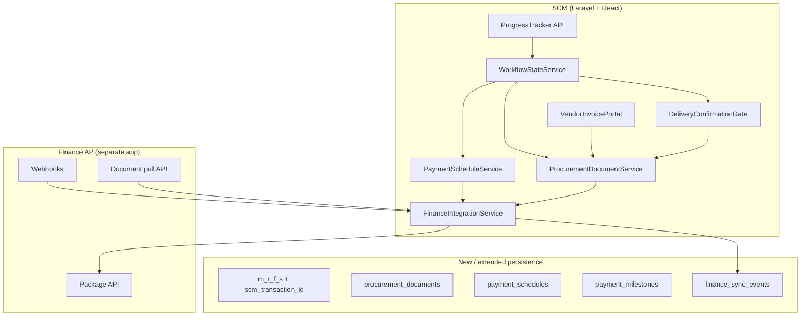

# SCM Platform — Finance AP & Vendor Invoice Implementation Plan

**Status:** Planning document — do not implement from this file alone; follow the authoritative brief.  
**Supersedes:** `FINANCE_AP_PROCUREMENT_WORKFLOW_DESIGN.md` wherever the two documents conflict.  
**Scope:** Finance Approval Workflow, Vendor Invoice Submission, Advance Payment Tracking (MRF procurement path only).  
**Out of scope:** SRF alignment, multi-currency formatting, historical price suggestions, mobile-first redesign.

---

## 1. Purpose and success criteria

### 1.1 What we are building

End-to-end procurement finance on SCM that:

1. Structures payment terms as versioned schedules with milestones (replacing free-text `payment_terms`).
2. Lets vendors submit a **single, locked** final invoice per MRF (gate depends on payment structure).
3. Optionally collects delivery confirmation documents before Finance AP handoff (milestone-driven).
4. Integrates with Emerald Finance AP via **hybrid push / webhook / pull**.
5. Extends the Progress Tracker through Finance review, milestone payments, and closure.
6. Routes post-cutover MRFs through Finance AP automatically; pre-cutover MRFs retain internal finance until complete.

### 1.2 Definition of done (program level)

| Criterion | Verification |
|-----------|--------------|
| Every MRF has immutable `scm_transaction_id` from creation | DB constraint + API always returns it |
| Single workflow state machine drives all gates | No controller checks conflicting `status` alone |
| Payment schedules enforce 100% milestone sum | Validation rejects invalid schedules |
| Vendor invoice: one active submission per `(vendor_id, mrf_id)` | DB unique constraint + portal UX |
| Finance AP receives full package on handoff | Integration test + `finance_sync_events` log |
| Webhooks update milestone and MRF states | Idempotent handler + correlation IDs |
| Progress Tracker shows steps 1–12 | API + UI match brief table |
| PO cannot close until `closure_readiness` passes | State transition tests per payment structure |
| All audit events logged | Schedule versions, documents, sync events, milestones |
| Every new/changed API documented in `frontend_changes.md` | Per-endpoint entries before frontend work |

---

## 2. Architecture overview



### 2.1 Cross-system contract (internal — same developer)

Before Phase 6 go-live, document and align (SCM ↔ Finance AP, same codebase owner):

| Item | Owner | Deliverable |
|------|-------|-------------|
| Outbound package JSON schema | SCM + Finance AP | OpenAPI or shared JSON Schema |
| Webhook payload schema + HMAC signing | Finance AP | Secret rotation process |
| Authenticated pull endpoints on SCM | SCM | API key / OAuth spec |
| `scm_transaction_id` echo on all Finance AP events | Finance AP | Field on their case model |
| `finance_ap_case_id` returned on create | Finance AP | Stored on MRF after first push |
| Idempotency key format | Both | `{scm_transaction_id}:{event_type}:{milestone_id}` |
| Environment URLs (dev/staging/prod) | Both | Config in `.env` |

---

## 3. Implementation phases (strict order)

Follow this sequence. **Do not start Finance AP integration until Phases 0–3 are complete.**

| Phase | Name | Brief reference | Blocks |
|-------|------|-----------------|--------|
| **0** | Pre-implementation foundations | Pre-Implementation §1–3 | Everything |
| **1** | Payment schedule & milestones | Part 1 | Parts 2, 3, 4, 6 |
| **2** | Document registry | Pre-Implementation §3 | Parts 2, 3, 4 |
| **3** | Workflow unification (extended states) | Pre-Implementation §2 + Parts 3, 6 | Parts 2, 4, 5 |
| **4** | Vendor invoice submission | Part 2 | Part 4 (delta push) |
| **5** | Delivery confirmation stage | Part 3 | Part 4 |
| **6** | Finance AP integration | Part 4 | Part 5 tracker finance steps |
| **7** | Route finance by cutover date | Part 4 (Finance role) | — |
| **8** | Progress Tracker, dashboards, reporting | Part 5 + audit | — |

> **Note on phase order:** Phases run **sequentially** (single developer). Complete Phase 0 before Phase 1, and so on. Phase 1 (payment schedule data model) must finish before Phase 3 wires milestone-driven gates into the state machine.

---

## Phase 0 — Pre-implementation foundations

**Goal:** Stable identifiers, unified state engine skeleton, document registry schema — no Finance AP calls yet.

### 0.1 `scm_transaction_id` on MRFs

**Backend tasks**

- [ ] Migration: add `scm_transaction_id` UUID column to `m_r_f_s`, unique, not null (backfill existing rows).
- [ ] Model: generate UUID in MRF `creating` observer; never mass-assignable for update.
- [ ] Expose in MRF list/detail API responses.
- [ ] Document in `frontend_changes.md`.

**Finance AP coordination**

- [ ] Finance AP adds `scm_transaction_id` column; echoes on all webhook payloads.

**Acceptance**

- New MRF always has UUID; existing MRFs backfilled; API returns field.

---

### 0.2 Unify workflow state machine (foundation)

**Backend tasks**

- [ ] Audit all controllers/services that read `status`, `current_stage`, or `workflow_state` (grep + inventory spreadsheet).
- [ ] Extend `WorkflowStateService` with new states:
  - `delivery_confirmation_pending`
  - `delivery_confirmation_complete`
  - `finance_handoff_pending`
  - `finance_in_review`
  - `milestone_payment_in_progress`
  - `financially_complete`
  - `operationally_complete`
  - `closed`
- [ ] Define valid transitions map (include legacy paths for in-flight MRFs).
- [ ] Introduce `WorkflowStateMapper` (or equivalent) to derive legacy `status` / `current_stage` from canonical `workflow_state` for backward compatibility during migration.
- [ ] Migration script: map in-flight MRFs to best-fit canonical state from current field combination.
- [ ] Refactor PO sign paths (`uploadSignedPO`, `signPurchaseOrder`) to use single transition helper.
- [ ] Unit tests: every documented transition; reject invalid transitions.

**Do not yet**

- Wire Finance AP or vendor invoice gates (Phase 3+).

**Acceptance**

- All PO-sign flows set same canonical state; legacy fields stay in sync via mapper; in-flight MRFs migrated without stuck records.

---

### 0.3 Document registry (`procurement_documents`)

**Backend tasks**

- [ ] Migration: `procurement_documents` table per brief:

  ```
  id, mrf_id, type, file_name, file_path, file_url,
  uploaded_by, uploaded_at, version, is_active
  ```

- [ ] Enum/type for: `vendor_invoice`, `grn`, `waybill`, `jcc`, `pfi`, `po_pdf`, `signed_po`, `delivery_confirmation`, `other`.
- [ ] Model + `ProcurementDocumentService`: upload, deactivate prior version, list by MRF/type.
- [ ] Unique partial index: one active `vendor_invoice` per `(mrf_id, vendor_id)` — requires `vendor_id` on document row or join via MRF selected vendor (add `vendor_id` nullable on table for constraint clarity).
- [ ] Gradual migration: read fallback from legacy `invoice_url`, `grn_url`, `pfi_url`, PO URLs when registry empty; write-through to registry on new uploads.
- [ ] Document in `frontend_changes.md`.

**Acceptance**

- New uploads go to registry; legacy URLs still readable; no breaking change to existing MRF detail responses (additive fields first).

---

## Phase 1 — Payment schedule & milestone model

**Goal:** Structured payment terms replacing free-text; templates; lifecycle propagation.

### 1.1 Database & domain

**Backend tasks**

- [ ] Migration: `payment_schedules` per brief (`template_name`, `total_percentage_check`, `created_by`, `approved_at`, `locked_at`, `version`).
- [ ] Migration: `payment_milestones` per brief (`milestone_number`, `label`, `percentage`, `amount`, `trigger_condition`, `required_documents` JSON, `status`, `paid_amount`, `paid_at`, `finance_ap_reference`, `predecessor_milestone_id`).
- [ ] Models + relationships: MRF → schedule → milestones.
- [ ] `PaymentScheduleService`:
  - Create from template or custom milestones.
  - Validate sum(percentage) === 100.
  - Version on edit before `locked_at`.
  - Lock on PO generation (per brief).
- [ ] `payment_schedule_versions` audit table (who, when, before/after JSON snapshot).

**Templates (seed)**

- [ ] 100% Advance
- [ ] 70% Advance / 30% Upon Delivery
- [ ] 50% Advance / 50% Upon Completion
- [ ] 30% Advance / 40% Upon Delivery / 30% Upon Completion

**Acceptance**

- Cannot save schedule unless percentages total 100%; version history recorded on edits.

---

### 1.2 API endpoints

| Method | Path (suggested) | Purpose |
|--------|------------------|---------|
| GET | `/mrfs/{id}/payment-schedule` | Current schedule + milestones |
| POST | `/mrfs/{id}/payment-schedule` | Create from template or custom |
| PUT | `/mrfs/{id}/payment-schedule` | Update (versioned if not locked) |
| GET | `/payment-term-templates` | List predefined templates |

Document all in `frontend_changes.md`.

---

### 1.3 Propagation through lifecycle

**Backend tasks**

- [ ] **RFQ:** attach schedule ID or embed milestone summary on RFQ create/update; expose to vendor RFQ views.
- [ ] **Quotation:** vendor submission displays payment structure (read-only from MRF schedule).
- [ ] **Price comparison:** include payment terms column in comparison export/API.
- [ ] **PO PDF** (`PurchaseOrderPdfService`): render milestone table on PO document (see milestone table spec below).
- [ ] **Finance package builder** (stub in Phase 1, full in Phase 6): serialize full schedule.

**PO PDF milestone table (required content)**

Each milestone must appear as a row containing:

- Milestone number
- Label
- Percentage of total
- Naira amount
- Trigger condition (e.g. Advance, Upon Delivery, Upon Completion)

The legacy free-text `payment_terms` field must **not** appear on POs generated after this implementation. Payment terms on the PO are represented solely by the structured milestone table.

**Frontend tasks (after API docs)**

- [ ] RFQ create/edit: select template or customize milestones.
- [ ] Quotation evaluation / price comparison: payment terms column.
- [ ] PO preview: show schedule on PO.

**Acceptance**

- Same schedule visible at RFQ, quotation, comparison, PO PDF.

---

### 1.4 Editability rules (enforcement)

| Stage | Rule | Implementation |
|-------|------|----------------|
| RFQ → quotation approval | Editable | Service checks `locked_at` null |
| PO generated | Locked | Reject PUT unless amendment flow creates new version |
| Finance AP case open | Amounts locked | Only webhook can advance milestone payment status |

---

## Phase 2 — Document registry completion

**Goal:** All document types used by later phases; GRN generate/upload APIs use registry.

**Backend tasks**

- [ ] GRN generate-from-line-items endpoint (Procurement Manager). **Generating a GRN** means producing a **GRN PDF document** auto-populated from the MRF line items (item descriptions, quantities, and units). The Procurement Manager reviews and confirms the generated document before it is saved to the document registry. This is not a database record only — it must produce a downloadable PDF.
- [ ] Waybill, delivery confirmation, JCC, PFI upload endpoints → registry.
- [ ] Refactor `GRNController` to use registry + new workflow states (remove post-payment-only assumption in Phase 3).
- [ ] Signed PO / PO PDF writes `signed_po` / `po_pdf` document rows on upload/generate.

**Acceptance**

- All brief document types uploadable; list API groups by type with active version.

---

## Phase 3 — Workflow gates (invoice timing, delivery confirmation, closure)

**Goal:** State machine enforces brief rules before Finance AP work begins.

### 3.1 Vendor invoice gate (logic only — portal in Phase 4)

**Rules (from brief)**

| Payment type | Invoice portal opens when |
|--------------|----------------------------|
| 100% advance or any advance milestone | Immediately after SCD approves vendor quote |
| Standard / split / delivery-based | After GRN received and confirmed |

**Backend tasks**

- [ ] `VendorInvoiceGateService::canSubmitInvoice(MRF): bool` driven by schedule + workflow state.
- [ ] Workflow transitions after SCD vendor quote approval:
  - **Advance path** → transition to a state that allows invoice submission **strictly upon SCD vendor quote approval**. PO generation is independent; the gate trigger is SCD quote approval only — not PO generation.
  - **Non-advance path** → block invoice submission until GRN has been received and confirmed (delivery confirmation complete).
- [ ] Hook into `approveVendorSelection` / RFQ award flows.
- [ ] Gate enforcement must live in the workflow state machine and backend API — not frontend-only checks.

---

### 3.2 Delivery confirmation stage

**Placement:** `PO Signed → [Conditional] Delivery Confirmation → Finance Handoff`

**Backend tasks**

- [ ] After PO signed: evaluate milestones — if any has `trigger_condition = upon_delivery` OR `required_documents` contains `grn` / `waybill`, set `delivery_confirmation_pending`.
- [ ] 100% advance-only schedules skip to `finance_handoff_pending`.
- [ ] `DeliveryConfirmationService`: check required docs for **current** milestone in registry.
- [ ] Auto-advance to `delivery_confirmation_complete` → `finance_handoff_pending` when satisfied.
- [ ] Procurement Manager APIs: upload/generate GRN, upload waybill, delivery docs (delegate to document service).

**Acceptance**

- Advance PO skips step 9 in tracker; delivery-based PO blocks Finance handoff until docs present.

---

### 3.3 Closure readiness

**Backend tasks**

- [ ] `ClosureReadinessService::evaluate(MRF): { financially_complete, operationally_complete, can_close, blockers[] }`.
- [ ] Rules per brief Part 6 (100% advance, split, services/JCC).
- [ ] Hard gate: `WorkflowStateService` cannot transition to `closed` unless `can_close`.
- [ ] Intermediate states: `financially_complete`, `operationally_complete`.

**Acceptance**

- Unit tests for each payment template scenario; premature close rejected.

---

## Phase 4 — Vendor invoice submission

**Goal:** Vendor portal upload; locked single submission; notifications.

### Vendor invoice gate rule (hard requirement)

The vendor invoice submission window is controlled by payment structure and enforced by the **workflow state machine and backend API** — not by the frontend alone.

| Payment structure | When the submission window opens |
|-------------------|----------------------------------|
| **100% advance** or **any advance milestone** | Immediately after the Supply Chain Director approves the vendor quote |
| **Standard, split, or delivery-based** | Only after the GRN has been received and confirmed |

The vendor portal must expose the Upload Invoice action only when `VendorInvoiceGateService::canSubmitInvoice(MRF)` returns true. API endpoints must reject submissions when the gate is closed (422), regardless of UI state.

### 4.1 Backend

**Backend tasks**

- [ ] Vendor portal routes (mirror logistics pattern): e.g. `POST /vendor-portal/mrfs/{mrfId}/invoice`.
- [ ] Auth: vendor user scoped to selected vendor on MRF.
- [ ] Enforce gate via `VendorInvoiceGateService` (advance: after SCD quote approval; delivery-based: after GRN confirmed).
- [ ] Enforce unique active `vendor_invoice` per `(vendor_id, mrf_id)` — reject second submission.
- [ ] On success: create registry row, attach references on MRF/RFQ/PO (link IDs, not duplicate files).
- [ ] **Delta push on late invoice:** if the MRF's Finance AP package has already been pushed to Finance AP at the time the vendor submits their invoice, automatically call `FinanceIntegrationService::pushDelta()` with reason `vendor_invoice_submitted`. This ensures Finance AP receives the updated document manifest without manual intervention.
- [ ] Update notifications on SCD quote approval (email + in-app): quote selected; vendor may submit final invoice and supporting documents.
- [ ] **Vendor notification privacy (hard requirement):** email and in-app notifications must **not** include the names, job titles, or roles of any users who approved or selected the quote. Apply this in the notification service implementation and in any email template created or updated for this flow.
- [ ] Visibility after submission: Procurement Manager, SCD, Executive, Finance (monitor), Finance AP (outbound package).
- [ ] Document in `frontend_changes.md`.

### 4.2 Frontend

**Frontend tasks**

- [ ] Vendor portal: Upload Invoice action visible only when gate open.
- [ ] Post-submit: read-only state, no resubmit UI (disputes offline).
- [ ] Internal MRF detail: invoice document card with download link.
- [ ] Verify existing UI elements before building new ones (per brief).

**Acceptance**

- Second upload returns 422; advance MRF can upload after SCD approval; delivery-based only after GRN confirmed.

---

## Phase 5 — Delivery confirmation UI

**Goal:** Procurement Manager section on MRF/PO detail.

**Frontend tasks**

- [ ] Step 9 tracker segment (conditional).
- [ ] Delivery Confirmation panel: upload GRN, generate GRN, waybill, delivery confirmation, other proof.
- [ ] Show checklist driven by current milestone `required_documents`.
- [ ] Auto-refresh when gate clears (poll or websocket).

**Backend tasks**

- [ ] Any remaining endpoints from Phase 3 exposed with full `frontend_changes.md` entries.

---

## Phase 6 — Finance AP integration

**Goal:** Connect SCM to the **existing** Finance AP platform (`financeap-backend` + `EmeraldFinanceAP` frontend) via REST push, webhooks, and document refresh — **not** build Finance AP from scratch.

**Authoritative cross-system spec:** `docs/FINANCE_AP_SIDE_SCM_INTEGRATION.md` (copied to `financeap-backend/docs/`). Integration decisions are **locked** (2026-05-31); implementation not started.

### Locked decisions (summary)

| Topic | Decision |
|-------|----------|
| Finance AP cases | SCM push creates **SCM case only** — no auto `purchase_orders` / `invoices` |
| Payments | Existing Finance AP `payment_requests` + `approval_thresholds` per milestone |
| Documents | Pull + **cache** on ingest/delta; SCM **document refresh** when signed URLs expire |
| Vendors | SCM master; `vendor_scm_mappings` on Finance AP |
| PO numbers | Cross-reference only; independent numbering per system |
| Ingest status | `pending_review` — Account Officer review, Finance Manager approval (no auto-approve) |

### Environment URLs

| | URL |
|---|-----|
| SCM → Finance AP (`FINANCE_AP_BASE_URL`) | `https://financeap-backend.onrender.com` |
| Finance AP → SCM webhooks | `https://supply-chain-backend-hwh6.onrender.com/api/webhooks/finance-ap` |

### 6.1 Persistence

- [ ] Migration: `finance_sync_events` per brief.
- [ ] MRF fields: `finance_ap_case_id`, `finance_ap_status` (optional convenience).

### 6.2 `FinanceIntegrationService`

**Responsibilities**

- [ ] `buildPackage(MRF, ?milestoneId): array` — header, schedule, lines, approvals summary, document manifest with checksums.

**Approvals summary (required content)**

Each approval stage in the package must include:

- Stage name
- Approval status
- Timestamp
- **Role label only** (e.g. Procurement Manager, Supply Chain Director)

The approvals summary must **never** include an individual user's name or email address. Role labels are sufficient for Finance AP audit purposes.

- [ ] `pushPackage(MRF, milestoneId)` — REST to Finance AP, queue + retry, idempotency key, log outbound to `finance_sync_events`.
- [ ] `handleWebhook(payload, signature)` — validate HMAC, idempotent processing, update milestone/MRF states.
- [ ] `pullPackage(scm_transaction_id)` / document refresh for Finance AP authenticated GET.
- [ ] `pushDelta(MRF, reason)` — when vendor invoice submitted after initial package (brief: delta push).

**Webhook `event_type` handling**

| Event | SCM action |
|-------|------------|
| `approved` | MRF → `finance_in_review` or milestone approved |
| `rejected` | Log reason; notify Procurement; optional rollback state |
| `payment_posted` | Update milestone `paid_amount`, `paid_at`, `finance_ap_reference`; evaluate `financially_complete` |
| `case_closed` | Finance case closed; evaluate closure readiness |
| `rfi_raised` | Notify Procurement; surface RFI details |

**Acceptance**

- End-to-end test with Finance AP sandbox; duplicate webhook ignored via idempotency; every sync logged with payload hash.

### 6.3 Config

- [ ] `config/finance_ap.php`: `base_url` = `https://financeap-backend.onrender.com`, webhook secret, API key, queue name, retry policy.
- [ ] SCM webhook route: `POST /api/webhooks/finance-ap` (see integration doc).

### 6.4 SCM frontend (monitor role)

- [ ] Finance dashboard: sync status, last event, milestone payment progress, link to Finance AP case (if URL provided).
- [ ] No “Process Payment” button when `mrfUsesFinanceAp($mrf)` is true.

### 6.5 Finance AP frontend (`EmeraldFinanceAP`)

- [ ] Nav item **“SCM Cases”** (Account Officer + Finance Manager only) from `GET /api/v1/me` `navigation`.
- [ ] List/detail: documents (cached), milestones, status; manual PO/invoice link optional.

---

## Phase 7 — Route finance by cutover date (no feature flag)

There is **no** `finance_ap_enabled` feature flag, **no** per-MRF toggle, and **no** config switch. Routing is determined solely by MRF creation date relative to a single **cutover date**.

### `mrfUsesFinanceAp` — keep it simple

The routing helper must be **only** a date comparison: MRF `created_at` against `config('finance_ap.cutover_date')`. No feature flags, no per-MRF overrides, no contract-type branching, and no other predicates.

```php
function mrfUsesFinanceAp(MRF $mrf): bool
{
    $cutover = config('finance_ap.cutover_date');

    return $cutover && $mrf->created_at->gte(Carbon::parse($cutover));
}
```

Place this in a small helper or static method (e.g. `MrfUsesFinanceAp::check($mrf)` calling the above). All cutover routing — disabling internal payment endpoints, Finance dashboard filters, permission checks — must call this single function.

**Backend tasks**

- [ ] Define `cutover_date` in `config/finance_ap.php` (sourced from `.env`, e.g. `FINANCE_AP_CUTOVER_DATE`). Set once at go-live; not editable per transaction.
- [ ] **Before cutover date:** MRFs complete finance through the existing internal flow (`processPayment`, chairman approval, etc.) unchanged.
- [ ] **On or after cutover date:** new MRFs are automatically routed through Finance AP. Disable `processPayment` / `approvePayment` (chairman flow) for these MRFs — return 410 or 422 with a clear message directing users to Finance AP.
- [ ] Routing helper: implement `mrfUsesFinanceAp()` exactly as above — `created_at >= cutover_date` only.
- [ ] Migrate finance dashboard queries to unified finance-ready predicate (not `status=finance` alone); segment or filter by cutover routing where relevant.
- [ ] Update `PermissionService`: for post-cutover MRFs, internal Finance role = view/sync only (no payment processing in SCM).

**Acceptance**

- Pre-cutover in-flight MRFs continue internal finance until completed.
- Post-cutover MRFs cannot be paid via SCM internal endpoints; Finance AP is the only payment path.

---

## Phase 8 — Progress Tracker, dashboards, reporting

### 8.1 Progress Tracker (Part 5)

Replace Step 7 “Process Complete” with:

| Step | Label | Conditional |
|------|-------|-------------|
| 1 | MRF Created | No |
| 2 | Initial Approval | No |
| 3 | Procurement Sourcing | No |
| 4 | RFQ Issued | No |
| 5 | Quotation Approval (PM + SCD) | No |
| 6 | Vendor Final Invoice | No |
| 7 | PO Generated | No |
| 8 | PO Signed | No |
| 9 | Delivery Confirmation | Yes — skip for advance-only |
| 10 | Finance Review | No |
| 11 | Payment Milestones | Repeatable sub-tracker |
| 12 | Closed | No |

**Backend:** extend `MRFController` progress timeline API with sub-milestone array for step 11.

**Frontend:** tracker UI + milestone sub-tracker.

### 8.2 Dashboards & reporting

- [ ] Outstanding PO balance by milestone.
- [ ] Advance paid, delivery docs outstanding (risk report).
- [ ] Cycle time: PO signed → Finance AP paid → docs complete.
- [ ] Finance AP rejection / RFI rate.

### 8.3 Audit (Part 7)

Confirm logging exists for:

- [ ] Payment schedule version changes
- [ ] Document uploads (supersession chain)
- [ ] Finance sync events (inbound/outbound, payload hash, correlation ID)
- [ ] Milestone state changes (`source`: `scm` | `finance_ap`)
- [ ] `MRFApprovalHistory` for human approvals

---

## 4. Dual approval gap (PM + SCD)

The brief requires **Quotation Approval (PM + SCD)** at Progress Tracker step 5. Today `QuotationController::approve` is PM-only; SCD approval uses separate MRF vendor selection flow.

**Plan**

- [ ] **Phase 1 or 3 (before vendor invoice notifications):** Consolidate to explicit two-step quotation approval state:
  - `quotation_pm_approved` → `quotation_scd_approved`
  - Vendor invoice notification fires only on SCD approval (final).
- [ ] Align `RFQWorkflowController` award path and `MRFWorkflowController::approveVendorSelection` to same orchestration (avoid duplicate/conflicting paths).
- [ ] Document consolidated flow in `frontend_changes.md`.

---

## 5. Frontend delivery process

For **every** backend endpoint created or modified:

1. Add entry to `docs/frontend_changes.md` (create file in Phase 0):
   - HTTP method + path
   - Request body schema
   - Response shape
   - Plain-English UI behaviour
2. **Before building UI:** search existing React components for the action (upload PO, finance dashboard, vendor portal, etc.).
3. Extend existing screens where possible; build new only when no element exists.
4. Every backend capability must be reachable from the frontend.

Suggested `frontend_changes.md` sections mirroring phases:

- Phase 0: MRF `scm_transaction_id` in types
- Phase 1: Payment schedule CRUD + templates
- Phase 2: Document list/upload components
- Phase 4: Vendor invoice portal page
- Phase 5: Delivery confirmation panel
- Phase 6: Finance sync status widgets
- Phase 8: Extended progress tracker

---

## 6. Testing strategy

| Layer | Focus |
|-------|--------|
| **Unit** | `PaymentScheduleService` validation, `ClosureReadinessService`, gate services, state transitions |
| **Feature** | API endpoints, webhook handler idempotency, document unique constraints |
| **Integration** | Finance AP sandbox push/webhook round-trip |
| **Migration** | In-flight MRF state mapping fixtures |
| **E2E** | Advance path: SCD approve → vendor invoice → PO → Finance handoff → payment webhook → close |
| **E2E** | Split path: PO → delivery docs → invoice (if after GRN) → milestone payments |

---

## 7. Risk register

| Risk | Mitigation |
|------|------------|
| Dual state fields cause stuck MRFs | Phase 0 mapper + migration script + monitoring query for inconsistent rows |
| Finance AP schema drift | Shared OpenAPI; contract tests in CI |
| Signed S3 URL expiry | Document manifest uses `document_id` + Finance AP pull API |
| Vendor invoice before PO on advance path | Brief allows; PO PDF may not include invoice number — document in package only |
| Chairman payment flow used on wrong cohort | Cutover date routing in `MrfUsesFinanceAp`; UI hides internal payment actions for post-cutover MRFs |
| Two vendor selection code paths | Phase 4 consolidation task |
| GRN legacy post-payment flow | Remove old transition; migrate docs to registry |

---

## 8. Team responsibilities

> **Note:** All workstreams are owned by a **single developer**. Phases run **sequentially**, not in parallel across separate teams. Finance AP coordination (API schema, webhooks, sandbox) is **internal** — SCM and Finance AP are built and maintained by the same person. The table below is for **reference only** and must not be read as parallel workstreams or handoff dependencies between separate people.

| Workstream | Owner | Depends on |
|------------|-------|------------|
| SCM backend Phases 0–3 | Single developer | — |
| SCM backend Phases 4–7 | Single developer | Finance AP API spec (internal) |
| Finance AP inbound/outbound API | Single developer | Phase 0 `scm_transaction_id` |
| SCM frontend | Single developer | `frontend_changes.md` per phase |
| QA / E2E | Single developer | Sandbox environments |
| DevOps (webhooks, secrets, queues) | Single developer | Phase 6 |

---

## 9. Suggested milestones (no dates)

1. **M1 — Foundation ready:** Phases 0–2 complete, migrations run, tests green.
2. **M2 — Workflow gates ready:** Phase 3 complete, closure + delivery logic tested.
3. **M3 — Vendor invoice live:** Phase 4 complete on staging.
4. **M4 — Finance AP connected:** Phase 6 sandbox round-trip.
5. **M5 — Production cutover:** Phase 7–8; set `FINANCE_AP_CUTOVER_DATE` / `finance_ap.cutover_date`; post-cutover MRFs use Finance AP only.

---

## 10. Reference — brief conflict with design doc

Where `FINANCE_AP_PROCUREMENT_WORKFLOW_DESIGN.md` differs from the brief, **follow the brief**:

| Topic | Brief (authoritative) | Design doc (superseded) |
|-------|----------------------|-------------------------|
| Vendor invoice resubmission | Locked after submit; no resubmit UI | Allowed until Finance accepts |
| Invoice timing | Advance: after SCD; delivery-based: after GRN | Hybrid / parallel with PO |
| Table name | `procurement_documents` on MRF | Generic polymorphic naming |
| Internal finance | Cutover date routing; post-cutover = Finance AP only | Partial overlap suggested |
| Finance routing | Cutover date; no feature flag | Feature flag suggested in earlier draft |

---

## 11. Deliverables checklist

- [ ] Migrations (all new tables/columns)
- [ ] `FinanceIntegrationService` + tests
- [ ] `ProcurementDocumentService` + tests
- [ ] `PaymentScheduleService` + tests
- [ ] `ClosureReadinessService` + tests
- [ ] Webhook controller + middleware (signature verification)
- [ ] Updated `WorkflowStateService` + migration command
- [ ] Extended Progress Tracker API
- [ ] `docs/frontend_changes.md` (living document)
- [ ] Finance AP integration OpenAPI (internal reference for both apps)
- [ ] Runbook: webhook failures, retry, manual sync

---

*Plan derived from SCM Platform — Finance AP & Vendor Invoice Implementation Brief. May 2026.*
