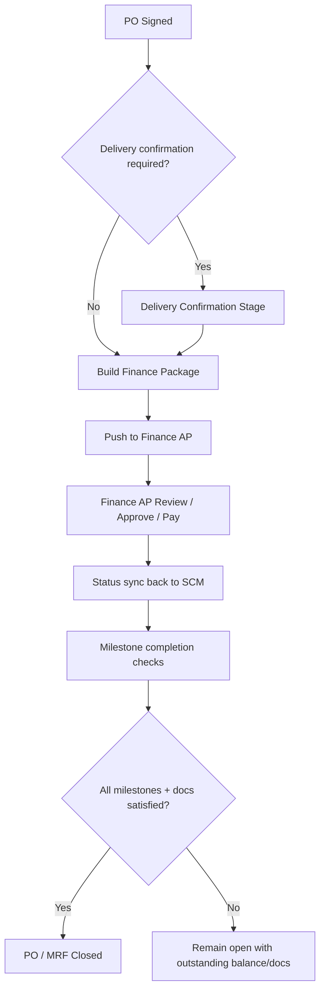
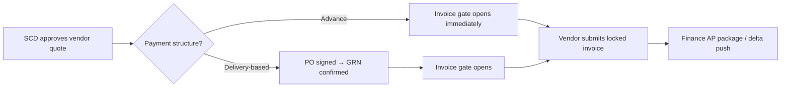
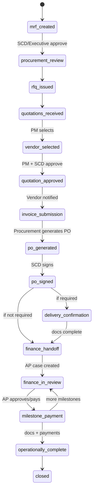

# Finance AP, Vendor Invoice & Advance Payment — System Design

> **Note:** This document is exploratory background. For authoritative requirements and the implementation plan, see the **SCM Platform — Finance AP & Vendor Invoice Implementation Brief** and [`FINANCE_AP_IMPLEMENTATION_PLAN.md`](./FINANCE_AP_IMPLEMENTATION_PLAN.md). Where this design doc conflicts with the brief or implementation plan, follow those documents.

This document captures the recommended system design and workflow for:

1. Finance Approval Workflow (Finance AP integration)
2. Optional Delivery Confirmation stage
3. Vendor Invoice Submission process
4. Advance Payment Tracking with flexible payment terms

It is mapped to the current SCM platform implementation and identifies gaps, conflicts, and integration requirements before development begins.

---

## Executive Summary

The requirements are directionally correct, but they collide with **three structural issues** in the current codebase:

1. **The post-PO lifecycle is only partially implemented** — finance, GRN, payment, and closure exist in code but are not wired into the Progress Tracker or the “simplified” workflow path.
2. **Two parallel state systems** (`workflow_state` vs `status` / `current_stage`) are out of sync, which will break any Finance AP integration unless unified first.
3. **Payment terms, documents, and vendor invoice submission are not first-class models** — they are mostly single URL fields and free-text strings.

Before building Finance AP integration, treat this as a **workflow unification + document/payment domain model** project, then layer integration on top.

---

## Current Platform Baseline

### Affected Modules Today

| Area | Role Today | Relevance to Requirements |
|------|------------|---------------------------|
| **MRF workflow** (`MRFWorkflowController`, `WorkflowStateService`) | Core procurement lifecycle | Primary place for new stages |
| **Progress Tracker** (`MRFController` timeline) | Ends at “PO Generated / Process Complete” | Must be extended |
| **RFQ / Quotation** (`RFQWorkflowController`, `QuotationController`) | Vendor selection, awards | Vendor invoice entry point |
| **PO generation/signing** (`MRFWorkflowController`) | PO PDF, SCD signature | Handoff trigger to Finance |
| **Finance (internal)** (`processPayment`, `approvePayment`, finance dashboard) | In-app finance + chairman approval | Pre-cutover MRFs only; post-cutover uses Finance AP (cutover date routing) |
| **GRN** (`GRNController`) | Post-payment GRN request/complete | **Opposite order** from many required scenarios |
| **Logistics vendor portal** (trips) | Vendor invoice upload pattern | Good reference; **not wired to MRF** |
| **JCC** (`JobCompletionCertificateService`) | Logistics trips only | Needs procurement equivalent or shared service |
| **Payment terms** | Free text on RFQ/quotation (`payment_terms`) | Not milestone-capable |

### Current End-to-End Flow (Simplified Path)


The Progress Tracker explicitly treats PO creation as completion (step 7: “Process Complete” — `MRFController`).

### Legacy Post-PO Flow (Exists but Disconnected)

`WorkflowStateService` still defines a richer lifecycle:

- **Simplified path:** `PO_SIGNED → CLOSED`
- **Legacy path:** `PO_SIGNED → PAYMENT_PROCESSED → GRN_REQUESTED → GRN_COMPLETED → CLOSED`
- **Legacy invoice path:** `VENDOR_SELECTED → INVOICE_RECEIVED → INVOICE_APPROVED → PO_GENERATED`

But `uploadSignedPO` often sets `status = signed` / `current_stage = finance` **without always updating** `workflow_state` to `po_signed`, while `processPayment` checks `status === 'finance'` — not `workflow_state`. That inconsistency is a major integration risk.

### GRN Timing Conflict

Today GRN is **after payment** (`GRNController` requires `STATE_PAYMENT_PROCESSED`).

The requirement often needs GRN **before** Finance approval/payment for balance milestones. That is a fundamental workflow inversion, not a small tweak.

### Vendor Invoice Today

- MRF has a single `invoice_url` field.
- Vendor selection can copy a quotation attachment into `invoice_url` — this is not a formal vendor final invoice workflow.
- Logistics has a mature vendor invoice pattern (`VendorSelectedForTripNotification`, vendor portal upload); MRF does not.
- `notifyVendorSelected` sends a generic “View RFQ Details” email — it does **not** prompt final invoice submission.

### No External Finance AP Integration

Finance today is internal: notifications, dashboard, `processPayment` → chairman approval. There is no outbound package API or inbound status webhook layer.

---

## Recommended Target Architecture

### Design Principle: One Workflow Engine, Configurable Gates

Instead of hard-coding “GRN always before Finance” or “GRN always after payment”, model each transaction with a **Payment Schedule + Document Requirement Matrix**. Stages become **gates driven by milestone rules**, not fixed global order.

---

## 1. Finance Approval Workflow

### Recommended Post-PO Sequence



### Modules to Change

| Module | Change |
|--------|--------|
| `WorkflowStateService` | Add states: `delivery_confirmation`, `finance_handoff_pending`, `finance_in_review`, `finance_completed`, `milestone_payment_in_progress` |
| Progress Tracker (`MRFController`) | Replace step 7 with post-PO substeps |
| New `FinanceIntegrationService` | Package builder, push, sync, retry |
| New `ProcurementDocumentService` | Unified document registry + versioning |
| `PermissionService` | Post-cutover MRFs: internal Finance role is monitor/sync only — no payment processing in SCM |
| `MRFApprovalHistory` | Record handoffs, sync events, milestone events |
| Finance dashboard | Show AP sync status, not duplicate payment actions |

### SCM ↔ Finance AP Communication (Recommended: Hybrid)

| Direction | Mechanism | Purpose |
|-----------|-----------|---------|
| **SCM → Finance AP (push)** | REST API on package readiness | Create/update AP case, attach metadata |
| **Finance AP → SCM (callback/webhook)** | Signed webhook events | Approval, rejection, payment posted, case closed |
| **Finance AP → SCM (pull)** | GET package/documents by SCM reference | Refresh expired signed URLs, fetch latest doc versions |
| **SCM → Finance AP (push updates)** | Delta sync (`pushDelta`) | When vendor submits invoice after initial package push; document manifest updates |

**Why hybrid:** Push gives immediacy and audit trail; pull solves S3 signed URL expiry and Finance AP reprocessing. Webhooks keep SCM status near-real-time without polling everything.

### Identifiers / References (Critical for Idempotency)

Use a stable cross-system key:

| Identifier | Owner | Usage |
|------------|-------|-------|
| `scm_transaction_id` | SCM | UUID on MRF/PO aggregate — primary external key |
| `mrf_id` / `formatted_id` | SCM | Human-readable reference |
| `po_number` | SCM | Business reference (not unique globally if regenerated) |
| `finance_ap_case_id` | Finance AP | Returned on first successful push |
| `milestone_id` | SCM | Stable UUID per payment milestone |
| `document_id` + `version` | SCM | Document sync and deduplication |
| `idempotency_key` | Both | `{scm_transaction_id}:{event_type}:{milestone_id}:{version}` |

Never rely on `po_number` alone as the integration primary key — PO regeneration already exists in the codebase.

### Data to Exchange

**SCM → Finance AP (initial package payload)**

- Header: MRF, RFQ, PO, vendor master, contract type, department, requester, currency, PO totals, tax
- Payment schedule: milestones, percentages, amounts, trigger conditions, required documents per milestone
- Line items: MRF/RFQ/PO line mapping
- Approvals summary (each stage): stage name, approval status, timestamp, **role label only** (e.g. Procurement Manager, Supply Chain Director). Must **never** include an individual user's name or email address.
- Document manifest: type, filename, checksum, secure URL or SCM doc ID, version, uploaded_by, uploaded_at
- Current milestone being requested for payment (if partial/advance)

**Finance AP → SCM (status events)**

- Case status: `received`, `in_review`, `approved`, `rejected`, `paid`, `closed`
- Milestone payment status: amount paid, payment reference, payment date, FX if applicable
- Rejection reason / request for information (RFI)
- Finance user actions (for audit, not necessarily displayed to vendors)

### Document Synchronization Strategy

Do **not** embed only expiring S3 URLs in Finance AP as the source of truth.

Recommended pattern:

1. SCM stores documents in object storage with immutable `storage_key`.
2. SCM sends manifest with `document_id`, `type`, `sha256`, `version`, optional time-limited URL.
3. Finance AP either pulls via authenticated SCM document API or ingests a copy on receipt.
4. When a vendor submits their invoice **after** the Finance AP package has already been pushed, SCM automatically calls `FinanceIntegrationService::pushDelta()` with reason `vendor_invoice_submitted` so Finance AP receives the updated document manifest without manual intervention.

Document types to normalize:

- `purchase_order_unsigned`, `purchase_order_signed`
- `vendor_invoice`, `proforma_invoice`
- `grn`, `jcc`, `waybill`, `delivery_confirmation`, `supporting`

### Required Documents (Finance Package)

Where applicable, include:

- Purchase Order (PO)
- Vendor Invoice
- Goods Received Note (GRN)
- Job Completion Certificate (JCC)
- Proforma Invoice (PFI) for advance payments
- Waybill
- Delivery Confirmation Documents
- Any additional supporting procurement documents

---

## Optional Delivery Confirmation Stage

### Is PO-After the Right Location?

**Yes, with conditions** — immediately after PO signed and before Finance handoff is the right default anchor because:

- PO is the contractual instrument Finance needs.
- Proof-of-delivery is operational, owned by Procurement/Logistics, not Finance AP.
- Advance milestones can skip this gate via configuration.

### Better Scalable Approach Than a Fixed Optional Stage

Model it as **`delivery_confirmation_gate`** on the transaction:

| Config | Behavior |
|--------|----------|
| `required_before_finance = false` | Skip stage; go straight to Finance package |
| `required_before_finance = true` | Block Finance handoff until docs satisfied |
| `required_for_milestones = [balance, completion]` | Allow advance milestone payment without GRN, block later milestones |

This supports:

- 100% advance → no GRN before first payment
- 70/30 → 70% with PO+PFI; 30% requires GRN/JCC
- Services → JCC instead of GRN

### What the Stage Should Allow

- **Generate GRN:** produce a **GRN PDF** auto-populated from MRF line items (descriptions, quantities, units). Procurement Manager reviews and confirms before saving to the document registry — not a database record only; must be a downloadable document.
- Upload GRN (if not generated in-system)
- Upload waybill / delivery note
- Attach delivery confirmation docs
- Mark stage complete (Procurement Manager) when milestone-required documents are satisfied

Completion should write to `ProcurementDocument` registry and satisfy milestone rules — not just set a boolean on MRF.

---

## Vendor Invoice Workflow

### Vendor invoice gate rule (hard requirement)

The vendor invoice submission window is enforced by the **workflow state machine and backend API** — not the frontend alone.

| Payment structure | When the submission window opens |
|-------------------|----------------------------------|
| **100% advance** or **any advance milestone** | Immediately after the Supply Chain Director approves the vendor quote |
| **Standard, split, or delivery-based** | Only after the GRN has been received and confirmed |

PO generation is **independent** of the advance-path gate. For advance payments, the gate trigger is **SCD quote approval only** — not PO generation.

The vendor portal and API must reject submissions when the gate is closed (422), regardless of UI state.

### Does It Fit the Existing Flow?

**Conceptually yes; operationally not yet.** The legacy states `invoice_received → invoice_approved → po_generated` align with part of the intent, but the current “simplified” path skips them. The authoritative model is **gate-by-payment-structure** (see table above), not a single global invoice-before-PO or PO-before-invoice order.

### Proposed Vendor Invoice Flow

1. Vendors submit quotations through the existing quotation process.
2. Procurement evaluates quotations.
3. The selected quotation is approved by both the Procurement Manager and the Supply Chain Director.
4. Once the quotation has been fully approved (PM + SCD):
   - The selected vendor receives an email notification and an in-app notification.
   - Both inform the vendor their quote was selected and they may submit their final invoice and supporting documents.
   - **Vendor notification privacy (hard requirement):** notifications must **not** include the names, job titles, or roles of any users who approved or selected the quote. Apply in the notification service and all email templates.
5. The vendor may upload (when the gate is open): Final Invoice and supporting documents — **one submission per vendor per MRF**, locked after submit (no resubmit UI; disputes handled offline).
6. The uploaded invoice becomes attached to the relevant MRF, RFQ, Vendor Quotation, and Purchase Order.
7. The invoice becomes accessible to Procurement Manager, Supply Chain Director, Executive Users, and Finance Users (monitor) where applicable.
8. The uploaded invoice is included in the Finance AP package. If the package was already pushed when the vendor submits, SCM automatically triggers `pushDelta()` with reason `vendor_invoice_submitted`.

### Submission policy (authoritative)

| Rule | Requirement |
|------|-------------|
| Submissions per MRF | One active `vendor_invoice` per `(vendor_id, mrf_id)` — unique constraint |
| After submit | **Locked** — no vendor resubmit or replace in portal |
| Disputes | Handled offline by Procurement; no resubmit UI |
| Delta sync | If Finance AP package already pushed at submit time → automatic `pushDelta(vendor_invoice_submitted)` |
| Audit | Log upload event (who, when); document stored in `procurement_documents` registry |

### Vendor invoice stage placement



Advance-path vendors may submit before PO exists. Finance handoff still requires PO signed (and delivery docs when applicable for that milestone).

### Operational Risks

- Vendor uploads invoice before quotation award → block by RFQ/quotation state checks
- Invoice amount ≠ PO amount → validation warnings at Finance handoff
- Multiple invoices for partial milestones → tie each to `milestone_id`
- Approver identity leakage in notifications → **hard rule:** no names, titles, or roles in vendor-facing notifications

Reuse the **logistics vendor portal pattern** for MRF: authenticated vendor user, scoped to awarded quotation/RFQ, document upload API, in-app + email notification on award.

---

## 2. Advance Payment Tracking

### Payment Structure Requirements

The system should support:

- 100% Advance Payment
- 70/30 Payment
- 50/50 Payment
- Other custom payment arrangements (e.g. 30/40/30)
- Total payment percentages always equal 100%
- Payment milestones clearly visible and traceable
- Payment terms auditable across the full lifecycle: RFQ → Quotation → Price Comparison → PO → Finance Approval → Payment Tracking
- Vendors can view and quote against the agreed payment structure where applicable
- Finance AP receives the complete payment schedule and milestone information during integration
- **PO PDF:** render a milestone table (not free-text `payment_terms`) with columns: milestone number, label, percentage of total, naira amount, trigger condition (e.g. Advance, Upon Delivery). Legacy free-text payment terms must not appear on POs generated after implementation.

### Expected Behaviour (Advance Payment Scenarios)

- Payment processing allowed using PO + Proforma Invoice (PFI)
- GRN and JCC should **not** be mandatory before advance payments
- Track payment percentages against the PO
- Track payment amounts already processed
- Display outstanding balances
- Maintain payment history and visibility of all payment transactions
- Track payment milestones and their completion status
- Track payment requests sent to Finance AP
- Track payment confirmations returned from Finance AP

### Payment Structure Data Model (Recommended Hybrid)

| Entity | Purpose |
|--------|---------|
| `payment_term_templates` | Reusable patterns: 100/0, 70/30, 50/50, custom |
| `payment_schedules` | Instance bound to MRF/RFQ/Quotation/PO; versioned |
| `payment_milestones` | Rows: sequence, %, amount, trigger, required_docs[], status |
| `payment_transactions` | Actual payments synced from Finance AP |
| `payment_schedule_versions` | Audit trail when terms change pre-lock |

**Hybrid approach:** templates seed schedules; authorized users can customize instance fields before lock.

Example milestone row:

```json
{
  "sequence": 1,
  "label": "Advance",
  "percentage": 70,
  "amount": 700000,
  "trigger": "on_po_signed",
  "required_documents": ["signed_po", "proforma_invoice"],
  "status": "pending|requested|paid|blocked"
}
```

Validation: sum(percentage) = 100; amounts reconcile to PO total ± rounding rules.

### When Editable vs Locked

| Stage | Payment Terms |
|-------|---------------|
| MRF / RFQ drafting | Editable (Procurement Manager) |
| Quotations open | Editable with re-notification to vendors if changed materially |
| Quotation selected | Editable only with SCD approval if change affects awarded price/terms |
| PO generated | **Locked by default** — changes require PO revision workflow |
| PO signed | **Fully locked** — changes only via formal amendment + new schedule version |
| Finance AP case open | Immutable except via amendment + delta sync |

Auto-create milestones when payment schedule is **approved** (recommend **at quotation award** so vendors quote against final structure).

### Finance Integration for Milestones

Each milestone payment should be a **separate Finance AP payment request** linked to the same case:

| SCM Action | Finance AP |
|------------|------------|
| Request milestone payment | `POST /payments` with `milestone_id`, docs subset |
| Finance pays | webhook `milestone.paid` with amount/reference |
| Partial payment | supported if Finance AP allows; SCM tracks `paid_amount` vs `milestone_amount` |
| Overpayment | block at validation |
| Milestone completion validation | Rule engine checks required docs + prior milestones paid |

SCM remains **orchestration + visibility**; Finance AP remains **payment execution system of record**.

### PO Closure Controls

Do **not** close PO when advance is paid if completion docs are outstanding.

Recommended closure rules:

| Payment Structure | Close Allowed When |
|-------------------|-------------------|
| 100% advance | All milestones paid + mandatory completion docs uploaded (GRN/JCC if configured post-delivery) + Finance case closed |
| Split milestones | All milestones paid + each milestone’s required docs satisfied |
| Services | JCC required before final milestone / closure |

Implement `closure_readiness` computed from milestones — not a single `status = completed`.

States:

- `open` — active procurement/payment
- `financially_complete` — all payments done, docs may remain
- `operationally_complete` — all required delivery/completion docs present
- `closed` — terminal; read-only

Prevent premature closure with hard gates in `WorkflowStateService` transitions to `closed`.

---

## Finance routing — cutover date (no feature flag)

There is **no** `finance_ap_enabled` feature flag, per-MRF toggle, or config switch.

| MRF created | Finance path |
|-------------|--------------|
| **Before** `finance_ap_cutover_date` | Existing internal flow (`processPayment`, chairman approval) until complete |
| **On or after** cutover date | Automatically routed through Finance AP; internal payment endpoints disabled for that MRF |

Use a routing helper **`mrfUsesFinanceAp($mrf)`** — a simple date comparison only (`created_at >= config('finance_ap.cutover_date')`). No feature flags or extra conditions. See implementation plan Phase 7 for the exact snippet. SCM and Finance AP are maintained by the same developer — coordination is internal.

---

## Recommended Unified Workflow (Full)



### Progress Tracker Steps (Suggested)

1. MRF Created
2. Initial Approval
3. Procurement Sourcing
4. RFQ Issued
5. Quotation Approval (PM + SCD)
6. Vendor Final Invoice *(new)*
7. PO Generated
8. PO Signed
9. Delivery Confirmation *(conditional)*
10. Finance Review *(Finance AP)*
11. Payment Milestones *(repeatable sub-tracker)*
12. Closed

---

## Conflicts, Gaps, and Contradictions with Current Implementation

| Issue | Impact | Resolution |
|-------|--------|------------|
| Progress Tracker ends at PO | Finance/delivery/payment invisible | Extend tracker |
| `workflow_state` vs `status` divergence | Broken gates, bad sync | Single state machine + mapped legacy fields during migration |
| GRN after payment | Blocks pre-payment GRN scenarios | Milestone-driven document gates |
| Internal `processPayment` + chairman flow | Overlaps Finance AP for new MRFs | **Cutover date routing:** pre-cutover = internal flow; on/after cutover = Finance AP only (no feature flag) |
| `payment_terms` as free text | Cannot track milestones | Structured schedule model |
| Single `invoice_url` on MRF | No versioning/audit | Document registry |
| JCC only in logistics | Service procurements lack JCC | Shared JCC module linked to MRF/PO |
| Two vendor selection paths (`MRFWorkflowController` vs `RFQWorkflowController`) | Inconsistent notifications/state | Consolidate selection + approval orchestration |
| `QuotationController::approve` is PM-only | Requirement needs PM **and** SCD | Dual approval state on quotation or MRF |
| Signed PO upload vs digital sign paths set different fields | Inconsistent finance entry | Normalize both to same post-sign transition |
| Finance dashboard filters `status=finance` | May miss records with `status=signed` | Unified finance-ready predicate |

---

## Audit, Reporting, and Long-Term Scalability

### Audit Requirements

- Every payment schedule version: who changed, when, before/after snapshot
- Every document version: immutable storage, supersession chain
- Every Finance AP sync: request/response payload hash, correlation ID
- Every milestone state change: source (`scm` vs `finance_ap`)
- Approval history continues via `MRFApprovalHistory` + new `finance_sync_events` table

### Reporting

- Outstanding PO balance by milestone
- Advance paid but undelivered (operational risk report)
- Average cycle time: PO signed → Finance AP paid → GRN/JCC completed
- Vendor invoice submission compliance (gate timing, locked submit)
- Finance AP rejection/RFI reasons

### Scalability

- Event-driven architecture (`ProcurementPackageReady`, `MilestonePaid`, `DocumentUploaded`)
- Rules engine for document requirements (avoid hard-coded if/else per payment type)
- Support SRF and logistics POs with same payment/document/finance primitives via shared `procurement_transactions` abstraction
- Queue-based outbound integration with retry/dead-letter
- **Finance routing:** single `finance_ap_cutover_date` — no per-MRF or global feature flag; MRFs created before cutover use internal finance until complete; MRFs created on/after cutover use Finance AP automatically

---

## Practical Implementation Sequence

1. **Workflow unification** — one state machine, migration for in-flight MRFs
2. **Payment schedule + milestone model** — propagate RFQ → quotation → PO
3. **Document registry + versioning** — replace single URL fields gradually
4. **Vendor invoice portal for MRF** — mirror logistics pattern
5. **Conditional delivery confirmation gate** — rules by milestone
6. **Finance AP integration layer** — push package, webhooks, pull docs, delta push on late vendor invoice
7. **Cutover date routing** — post-cutover MRFs use Finance AP only; pre-cutover MRFs retain internal finance (no feature flag)
8. **Progress Tracker + dashboards + reporting** — last mile visibility

---

## Direct Answers to Clarification Questions

| Question | Recommendation |
|----------|----------------|
| Payment terms: templates vs custom? | **Hybrid** — templates instantiate editable schedules |
| Auto-create milestones? | **Yes**, on schedule approval (quotation award) |
| When editable? | Until PO signed; amendments after with versioned schedule |
| When locked? | PO signed; Finance AP case open = payment-locked |
| Finance milestone sync? | One AP case, many milestone payment events with stable IDs |
| Partial payments? | Track `paid_amount`; allow if Finance AP supports |
| Milestone validation? | Rule engine on required docs + predecessor milestones |
| PO closure with advance paid, no GRN? | Keep PO **open** (`financially_complete` not `closed`) until configured completion docs uploaded |
| Mandatory docs before closure? | **Per payment schedule**, not global |
| Integration push vs pull? | **Hybrid** push + webhook + authenticated pull |
| Vendor invoice resubmit? | **No** — locked after submit; disputes offline |
| Duplicate invoices? | Unique active `(vendor_id, mrf_id)` for `vendor_invoice` |
| Finance routing? | **`finance_ap_cutover_date`** — no feature flag; pre-cutover = internal, post-cutover = Finance AP |

---

## Related Code References

| File | Relevance |
|------|-----------|
| `app/Services/WorkflowStateService.php` | Workflow states and transitions |
| `app/Http/Controllers/Api/MRFController.php` | Progress Tracker timeline |
| `app/Http/Controllers/Api/MRFWorkflowController.php` | PO generation, signing, payment |
| `app/Http/Controllers/Api/GRNController.php` | GRN request/complete (post-payment today) |
| `app/Http/Controllers/Api/QuotationController.php` | Quotation approval |
| `app/Http/Controllers/Api/RFQWorkflowController.php` | Vendor selection and award |
| `app/Services/Logistics/JobCompletionCertificateService.php` | JCC (logistics only) |
| `app/Services/WorkflowNotificationService.php` | Vendor selected notifications |
| `app/Models/MRF.php` | Invoice, PFI, GRN, PO fields |

---

## Authoritative decisions (aligned with implementation plan)

| Topic | Decision |
|-------|----------|
| Finance routing | `finance_ap.cutover_date` only — `mrfUsesFinanceAp()` = simple `created_at` date compare; no feature flag |
| Vendor invoice gate | Advance: after SCD quote approval; delivery-based: after GRN confirmed; backend-enforced |
| Advance gate vs PO | Independent — SCD approval triggers advance gate, not PO generation |
| Vendor invoice submit | One locked submission; no portal resubmit |
| Vendor notifications | No approver names, titles, or roles |
| Late vendor invoice | Auto `pushDelta(vendor_invoice_submitted)` if package already pushed |
| GRN generate | PDF from line items; PM confirms before registry save |
| PO PDF payment terms | Milestone table only; no legacy free-text field |
| Finance AP approvals summary | Role labels only; no user names or emails |
| Delivery ownership | Single developer; phases sequential — see implementation plan |

---

*Document generated from system design analysis — May 2026. Aligned with FINANCE_AP_IMPLEMENTATION_PLAN.md.*
